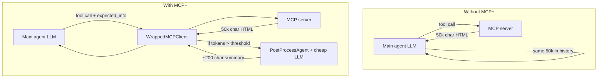
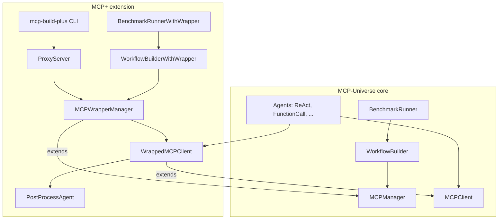
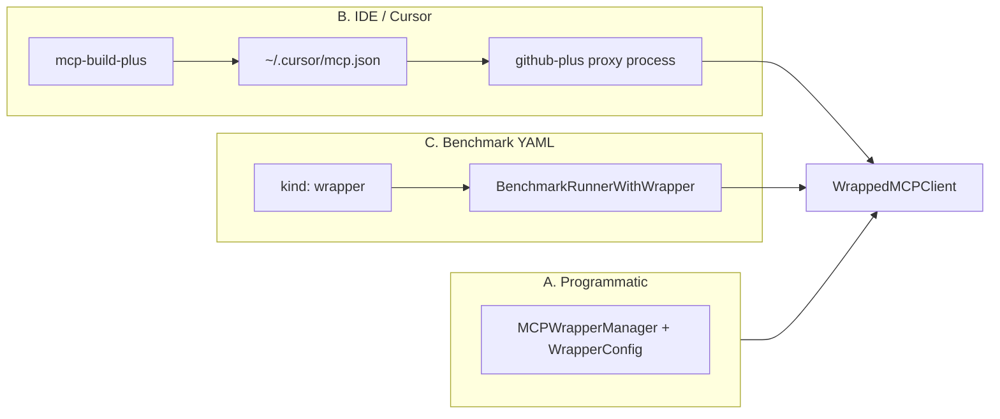
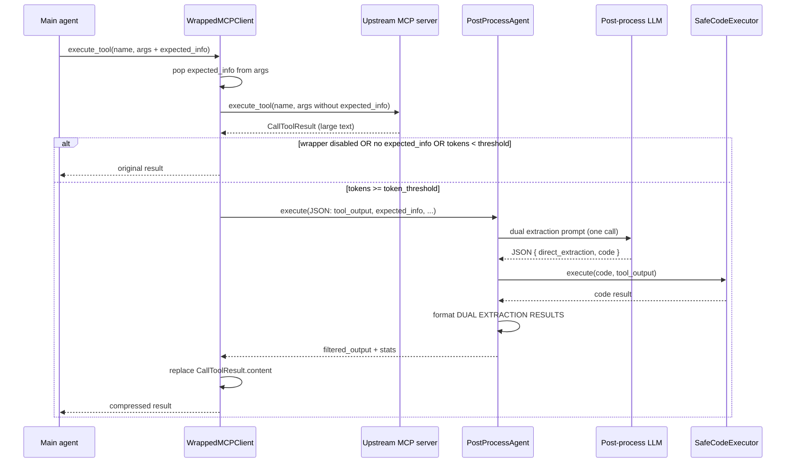
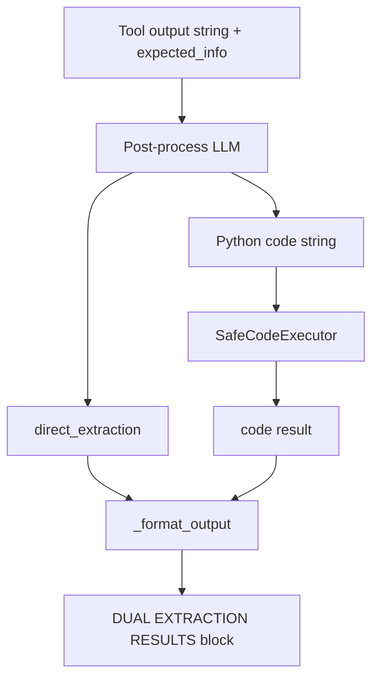
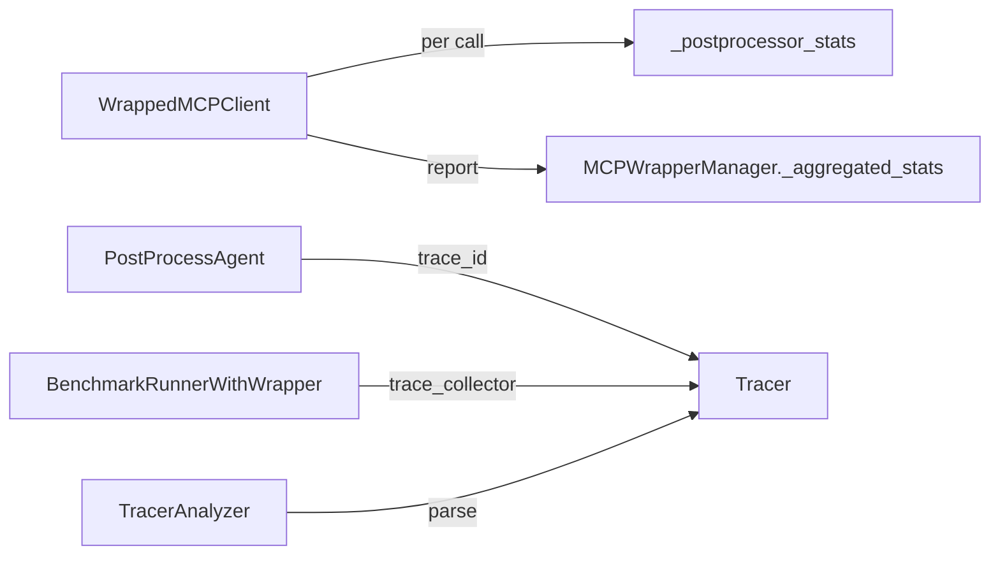
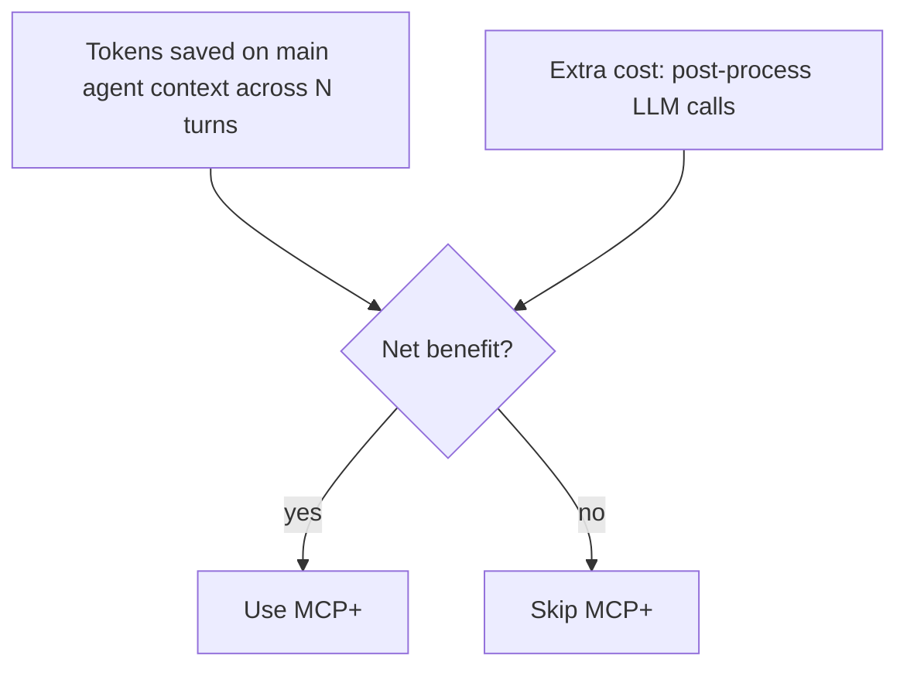

# MCP+ — Technical Deep Dive

In-depth breakdown of **MCP+** (MCPPlus) as implemented in MCP-Universe: what it does, where it lives, how data flows, and which files implement each piece.

**Official extension path:** `mcpuniverse/extensions/mcpplus/`  
**CLI entry point:** `mcp-build-plus` (registered in `pyproject.toml`)  
**External site:** [mcp-plus.github.io](https://mcp-plus.github.io)

---

## 1. Problem and solution

### The problem

MCP tools often return **large, verbose payloads** — full HTML pages, JSON API dumps, file contents, Playwright snapshots. In a multi-turn agent loop, every byte of that output is:

1. Appended to the agent's conversation history
2. Re-sent to the main LLM on **every subsequent turn**
3. Billed as input tokens

So one fat tool call can dominate context and cost for the rest of the episode.

### What MCP+ does

MCP+ is a **client-side interception layer**. It sits between your **agent** and your **real MCP server**, and when a tool response is "too big," it runs a **secondary LLM pass** (the post-processor) to extract only what the agent said it needed.

It does **not** change MCP server code. It does **not** reduce how many tools are visible to the agent. It **compresses tool outputs** on the way back.



**Claimed savings:** ~50–75% token reduction on tool-heavy workloads (see project benchmarks / site).

---

## 2. Position in MCP-Universe



MCP+ **extends** existing types; it does not fork the agent framework. When wrapper is disabled, `MCPWrapperManager.build_client()` delegates to `MCPManager.build_client()` unchanged.

---

## 3. Deployment modes

MCP+ can be used in three ways:



| Mode | Entry | Use case |
|------|--------|----------|
| **Programmatic** | `MCPWrapperManager` in Python | Custom agents, notebooks, services |
| **CLI (`mcp-build-plus`)** | Wrap `mcp.json` | Cursor / Claude Desktop — adds `*-plus` servers |
| **Benchmark** | `kind: wrapper` in YAML + `BenchmarkRunnerWithWrapper` | Measure token savings vs baseline |

### CLI flow (`mcp-build-plus`)

1. Read user's `mcp.json` (Cursor/Claude MCP config)
2. For each server, write a **proxy config JSON** to `~/.mcpplus/configs/<server>-plus.json`
3. Add new MCP server entries named `<original>-plus` that launch the proxy
4. Proxy process = `ProxyServer` → `MCPWrapperManager` → upstream real server

**File:** `mcpuniverse/extensions/mcpplus/tools/wrap_mcp_config.py`

---

## 4. End-to-end request flow



### Gating conditions (all must pass for post-processing)

| # | Condition | If false |
|---|-----------|----------|
| 1 | `WrapperConfig.enabled == True` | Return raw result |
| 2 | Caller supplied `expected_info` in tool arguments | Return raw result |
| 3 | `count_tokens(output) >= token_threshold` | Return raw result |
| 4 | Post-processor LLM configured (`set_llm()` called) | Error at client build time |

**Important:** If post-processing **throws** or returns `None`, the wrapper **always falls back to the original tool output**. The main agent never fails because MCP+ failed.

---

## 5. Core components

### 5.1 `WrapperConfig` + `MCPWrapperManager` + `WrappedMCPClient`

**File:** `mcpuniverse/extensions/mcpplus/wrapper/wrapper_manager.py`

| Class | Role |
|-------|------|
| `WrapperConfig` | Dataclass: `enabled`, `token_threshold`, `post_process_llm`, `llm_timeout`, `max_iterations`, `skip_iteration_on_size_failure` |
| `MCPWrapperManager` | Subclass of `MCPManager`; builds wrapped clients; aggregates stats; manages shared post-processor tracer |
| `WrappedMCPClient` | Subclass of `MCPClient`; overrides `list_tools()` and `execute_tool()` |

**`list_tools()` behavior:** When wrapper is enabled, injects an optional string parameter `expected_info` into every tool's JSON Schema `properties`, with a long instructional description telling the main agent how to write good extraction goals.

**`execute_tool()` behavior:**

1. `expected_info = arguments.pop("expected_info", None)`
2. Forward call to real MCP server (upstream never sees `expected_info`)
3. Measure tokens via `tiktoken` (`utils/stats.py`)
4. Optionally invoke `PostProcessAgent`
5. Replace `CallToolResult.content` with filtered text while preserving result structure

**Client wrapping:** `_wrap_client()` copies session state (`_session`, `_exit_stack`, `_server_params`, etc.) from the underlying `MCPClient` onto a new `WrappedMCPClient` shell — same connection, different `execute_tool` implementation.

---

### 5.2 `PostProcessAgent` (dual extraction)

**File:** `mcpuniverse/extensions/mcpplus/agent/react_postprocess_agent.py`

Not a full ReAct loop despite the filename — it is a **single-purpose extraction agent** subclassing `BaseAgent` with **no MCP manager** (`mcp_manager=None`).

#### One LLM call, two extraction strategies

The prompt (`DUAL_EXTRACTION_PROMPT`) asks the post-process LLM to return JSON:

```json
{
  "direct_extraction": "<plain text summary>",
  "code": "<Python that sets result from data>"
}
```



#### Iteration logic (`max_iterations`, default 3)

Retries when:

- LLM returns invalid JSON
- Both extractions empty
- Code execution fails
- Both outputs exceed **50% of input token count** (unless `skip_iteration_on_size_failure` returns original immediately)

On success, returns a formatted block with both **DIRECT EXTRACTION** and **CODE-BASED EXTRACTION** sections so the main agent can use either.

On total failure after all iterations, returns **original unprocessed tool output** (same safety as wrapper fallback).

#### Response envelope to wrapper

`PostProcessAgent._execute()` returns `AgentResponse` whose `response` field is JSON:

```json
{
  "filtered_output": "<formatted dual extraction text>",
  "stats": { "postprocessor_iterations", "original_tokens", "filtered_tokens", ... }
}
```

`WrappedMCPClient._post_process()` parses this and updates manager-level `_aggregated_stats`.

---

### 5.3 `SafeCodeExecutor`

**File:** `mcpuniverse/extensions/mcpplus/utils/safe_executor.py`

Runs LLM-generated filter code with:

| Mechanism | Detail |
|-----------|--------|
| **Input binding** | `data` = raw tool output string; code must set `result` |
| **Blacklist** | Static string scan blocks `eval`, `exec`, `subprocess`, `os.system`, `__import__`, pickle, etc. |
| **Timeout** | `signal.SIGALRM` on Unix (10s default from wrapper); **no timeout on Windows** (signal unavailable) |
| **Execution** | `exec(code, local_vars)` in-process — **not** a separate container |

This is **output filtering**, not MCP orchestration. The generated code cannot call MCP tools.

---

### 5.4 `ProxyServer`

**File:** `mcpuniverse/extensions/mcpplus/tools/proxy_server.py`

Standalone **FastMCP server** that:

1. Connects to an upstream MCP server via `MCPWrapperManager.build_client()`
2. Calls `list_tools()` on the wrapped client
3. **Mirrors** each upstream tool as a local FastMCP tool with the same name/schema (+ `expected_info` in description)
4. On invocation, forwards to `wrapped_client.execute_tool()`

This is how `mcp-build-plus` exposes `github-plus` etc. to Cursor without modifying the original `github` server binary.

Supports stdio, SSE, and HTTP upstream transports; can register dynamic server configs not in `server_list.json`.

---

### 5.5 Benchmark integration

| File | Class | Purpose |
|------|-------|---------|
| `benchmark/builder.py` | `WorkflowBuilderWithWrapper` | Parses YAML `kind: wrapper`; builds `MCPWrapperManager` instead of `MCPManager` |
| `benchmark/benchmark_runner.py` | `BenchmarkRunnerWithWrapper` | Uses wrapper builder; wires trace collector to manager; tracks post-processor trace IDs per task |
| `benchmark/report.py` | `BenchmarkReportWithWrapper` | Report handles multiple LLMs (agent + post-processor); appends wrapper/token savings stats |

#### Example YAML extension

```yaml
kind: wrapper
spec:
  enabled: true
  token_threshold: 2000
  post_process_llm: postprocessor-llm   # references another kind: llm block
  max_iterations: 3
  llm_timeout: 500
```

The wrapper `kind` is stripped before the base `WorkflowBuilder` sees the config (it only understands `llm`, `agent`, `workflow`).

---

### 5.6 Utilities

| File | Purpose |
|------|---------|
| `utils/stats.py` | `count_tokens()` via `tiktoken`; `PostProcessStats` dataclass |
| `utils/tracer_analyzer.py` | Parses trace logs for main-agent vs post-processor token/cost metrics |
| `utils/safe_executor.py` | Sandboxed-ish code execution for filter scripts |

*(README mentions `tracking_llm.py` in the tree diagram; that file is not present in the current repo — tracing uses standard `Tracer` + `TracerAnalyzer` instead.)*

---

## 6. Configuration reference

### `WrapperConfig` defaults

| Field | Default | Meaning |
|-------|---------|---------|
| `enabled` | `False` | Master switch |
| `token_threshold` | `2000` | Min output tokens before post-processing |
| `post_process_llm` | `gpt-5-mini` via openai | Cheap model for extraction |
| `llm_timeout` | `500` | Seconds for post-process LLM call |
| `max_iterations` | `3` | Post-process retry cap |
| `skip_iteration_on_size_failure` | `False` | If both outputs too large, retry vs return original |

### The `expected_info` contract

Added to every tool schema when wrapper is enabled. The **main agent** must pass it on tool calls for compression to run.

Good example (from wrapper code):

> "The adult ticket price for ABC Theatre from the pricing table, needed to answer the user's question about ticket cost"

Bad: `"get information"`, `"price"`, `"check the page"`

The post-processor prompt includes `expected_info` as **Agent's Goal** so the cheap LLM knows what to keep.

---

## 7. Statistics and observability



**Manager API:**

- `get_all_postprocessor_stats()` — cumulative tokens/chars saved
- `get_postprocessor_trace_id()` — link post-process traces to benchmark tasks
- `reset_postprocessor_tracer()` — per-task reset in benchmarks

---

## 8. Complete file map

```
mcpuniverse/extensions/mcpplus/
├── README.md                          # User-facing docs + quick start
├── agent/
│   ├── __init__.py
│   └── react_postprocess_agent.py     # PostProcessAgent + DUAL_EXTRACTION_PROMPT
├── wrapper/
│   ├── __init__.py
│   └── wrapper_manager.py             # WrapperConfig, MCPWrapperManager, WrappedMCPClient
├── tools/
│   ├── __init__.py
│   ├── wrap_mcp_config.py             # mcp-build-plus CLI
│   └── proxy_server.py                # FastMCP proxy for IDE integration
├── benchmark/
│   ├── builder.py                     # WorkflowBuilderWithWrapper
│   ├── benchmark_runner.py          # BenchmarkRunnerWithWrapper
│   └── report.py                      # BenchmarkReportWithWrapper
├── utils/
│   ├── __init__.py
│   ├── safe_executor.py               # Filter code runner
│   ├── stats.py                       # tiktoken counting + PostProcessStats
│   └── tracer_analyzer.py             # Trace → cost/token metrics
└── examples/
    ├── README.md
    ├── basic_wrapper.py
    ├── benchmark_integration.py
    └── configs/                       # sample YAML configs

tests/extensions/mcpplus/
├── agent/test_react_postprocess_agent.py
├── wrapper/test_wrapper_manager.py
├── tools/test_proxy_server.py
├── utils/test_safe_executor.py
├── utils/test_stats.py
└── integration/test_integration.py

pyproject.toml
└── [project.scripts] mcp-build-plus → wrap_mcp_config:main
```

---

## 9. Cost trade-off model



**Pays off when:**

- Tool outputs are large (>> `token_threshold`)
- Agent runs many turns after the tool call (compressed output stays in history)
- You can write meaningful `expected_info` (or train/prompt the agent to)

**Poor fit when:**

- Outputs already small (<500 tokens)
- You need the **entire** raw payload every time
- Post-process latency matters more than token cost
- Windows-only deployments relying on code-path timeout (weaker sandbox timing)

---

## 10. What MCP+ is **not**

| Concept | MCP+ | FastMCP Code Mode (external) |
|---------|------|------------------------------|
| Reduces tool **catalog** in context | No | Yes (`search`, `get_schema`, `execute`) |
| LLM writes code to **call MCP tools** | No | Yes (`call_tool` in sandbox) |
| Layer | MCP **client** wrapper | MCP **server** transform |
| Discovery | None | BM25 search, tags, schemas |

MCP+ and Code Mode solve **orthogonal** problems: MCP+ shrinks **responses**; Code Mode shrinks **tool surface** and **round-trips** via scripted orchestration.

See `my_tests/CODE_MODE_AND_MCP_PLUS.md` for a shorter comparison.

---

## 10. Quick commands

```bash
# Install + wrap Cursor MCP config
pip install mcpuniverse
export OPENAI_API_KEY=...
mcp-build-plus --mcp-config ~/.cursor/mcp.json

# Run MCP+ tests
pytest tests/extensions/mcpplus/ -v

# Programmatic
python mcpuniverse/extensions/mcpplus/examples/basic_wrapper.py
```

---

## 11. Mental model (one paragraph)

**MCP+ is a transparent MCP client shim.** The main agent still sees the same tool names and calls them the same way, but each tool gains an optional `expected_info` argument. When a response is huge and the agent explained what it needs, a cheap secondary LLM reads the blob once, tries both direct summarization and generated Python filtering, and hands back a short dual-report. The wrapper swaps that in place of the raw MCP payload before the main agent's next turn — cutting repeated token tax across the rest of the conversation. Failures at any step silently degrade to the original output.
