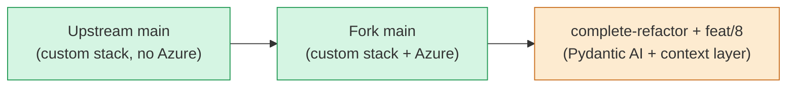
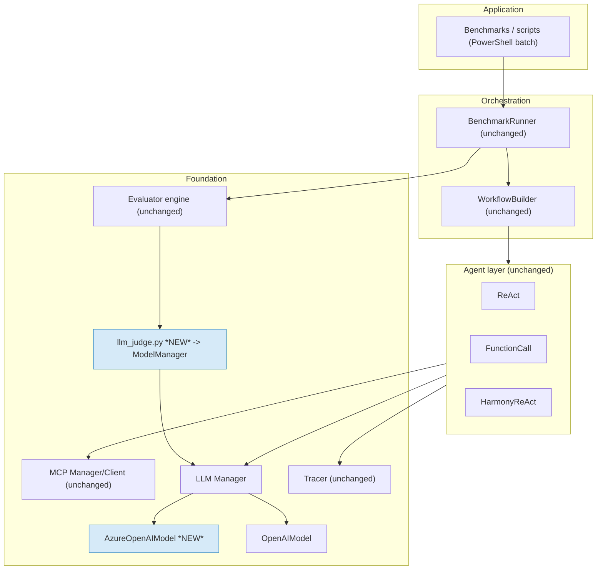
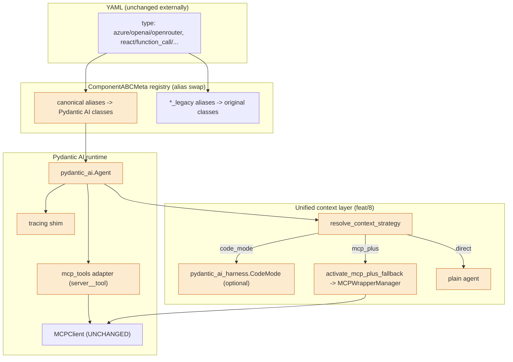
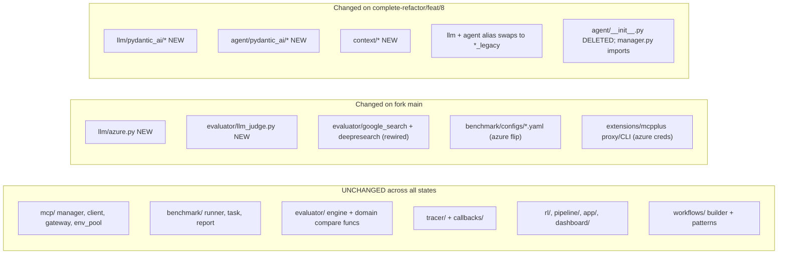
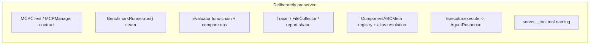
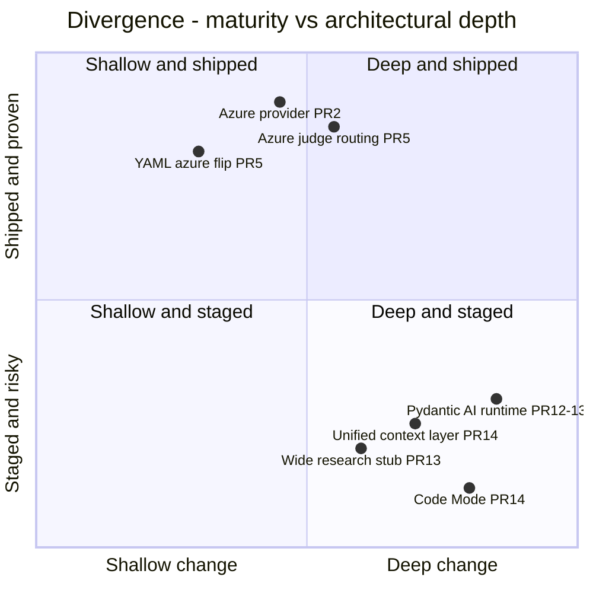

# Architecture Delta — Upstream vs Fork

> Side-by-side architectural comparison of upstream `SalesforceAIResearch/MCP-Universe` and this fork.
> Because the fork has **two live architectures**, this doc distinguishes fork `main` (shipped) from `complete-refactor`/`feat/8` (staged).
> Companion: [`fork_evolution.md`](./fork_evolution.md), [`pr_analysis/`](./pr_analysis/). Original-architecture reference: [`technical_breakdown.md`](./technical_breakdown.md), [`MCP_PLUS.md`](./MCP_PLUS.md), [`llm_judge.md`](./llm_judge.md).

---

## 1. The three states

| | Upstream `main` | Fork `main` (shipped) | `complete-refactor` (+`feat/8`, staged) |
|--|------------------|-----------------------|------------------------------------------|
| Agent runtime | Custom `BaseAgent` | Custom `BaseAgent` | **Pydantic AI** adapters |
| LLM factory | `BaseLLM` × ~15, no Azure | + `AzureOpenAIModel` | + `PydanticAI*` providers; legacy→`*_legacy` |
| Evaluator judges | direct OpenAI | **`ModelManager`-routed** | `ModelManager`-routed |
| Context reduction | MCP+/summarize/SafeExec | same | + unified `ContextStrategy` + Code Mode |
| Benchmark YAML | `openai`/`openrouter` | `azure` | `azure` |
| MCP / env_pool / tracer / benchmark / evaluator engine | baseline | **unchanged** | **unchanged** (adapters only) |

---

## 2. Current (fork `main`) architecture

The shipped fork is upstream's layered design (`./technical_breakdown.md` §3) with two surgical insertions, both in the foundation layer.

**Net structural change vs upstream:** two new foundation components (`AzureOpenAIModel`, `llm_judge`) and a re-wiring of the evaluator judge from a direct OpenAI client into `ModelManager`. Everything else (agents, MCP layer, benchmark runner, evaluator engine, tracer, RL, app, dashboard) is byte-for-byte upstream.

---

## 3. Staged (`complete-refactor` + `feat/8`) architecture

Key staged changes vs fork `main`:
* **Registry alias swap** (PR #12/#13): `azure`/`openai`/`openrouter`/`react`/`function_call`/`function_call_wide_research` now resolve to Pydantic AI classes; originals demoted to `*_legacy`.
* **MCP tool adapter** preserves the `server__tool` convention and routes through the unchanged `MCPClient`.
* **Unified context layer** (PR #14, open) adds a strategy selector wiring Code Mode and MCP+ fallback.

---

## 4. Component-by-component delta

| Subsystem (`my_docs` ref) | Upstream | Fork `main` | `complete-refactor`/`feat/8` |
|---------------------------|----------|-------------|------------------------------|
| MCP+ (`MCP_PLUS.md`) | baseline | + Azure cred passthrough in proxy/CLI | reused via `activate_mcp_plus_fallback` |
| LLM Judge (`llm_judge.md`) | 2 judges, direct OpenAI | unified via `llm_judge.py` + `ModelManager` | inherited |
| Tool execution (`technical_breakdown.md` §7) | `MCPClient` | unchanged | unchanged (adapter on top) |
| Context handling | summarize / MCP+ / SafeExec | unchanged | unified `ContextStrategy` |
| Evaluation framework (§10–11) | expression engine | unchanged (judge rewired) | unchanged |
| Model routing (§6) | `ModelManager` + ~15 providers | + Azure | Pydantic AI providers via factory pattern |
| Agent workflows (§8–9) | custom loops | unchanged | Pydantic AI agents (uneven: FC native, ReAct backend-swap, wide stub) |
| Sandbox systems (§7 env_pool) | Docker env pool | unchanged | unchanged (LangChain sandbox is design-only) |
| Cost optimization | MCP+ token reduction | unchanged | + Code Mode (optional, unproven) |

---

## 5. Areas of convergence (fork stays aligned with upstream)

The fork is **strongly convergent** with upstream at every stable contract the design doc (§"Key interfaces") enumerates. Both migrations were explicitly engineered to keep these seams intact — the Azure work adds providers within the existing registry; the Pydantic AI work adapts *behind* the same `Executor` / `MCPClient` / evaluator boundaries. This is the fork's biggest strength: divergence is concentrated, not pervasive.

---

## 6. Areas of divergence (and their nature)

| Divergence | Depth | Maturity | Notes |
|------------|-------|----------|-------|
| Azure provider + judge | Foundation insert | Shipped/tested | Idiomatic; strongly justified |
| Benchmark YAML → azure | Config | Shipped | Hardcodes deployment names (`gpt-5.4-mini`) — env-specific |
| Pydantic AI runtime | **Deep** (runtime swap) | Staged, unmerged | Reversible via `*_legacy`; tracing lossy |
| Wide research migration | Deep | Stub on canonical alias | Behavioral risk for deep-research |
| Unified context layer | Deep | Open PR | Selector solid; MCP+ fallback real |
| Code Mode | Deep | Unproven | Optional dep; capability gate vs Azure deployments |

---

## 7. Divergence risk summary

| Risk | Location | Severity | Mitigation status |
|------|----------|----------|-------------------|
| Two architectures (main vs refactor) | branch topology | High | None — refactor unmerged |
| Wide research stub on canonical alias | refactor | High | Out-of-scope per PR #13 |
| Code Mode capability misfires on Azure deployments | `context/layer.py` | High | None |
| Docs on `main` describe off-`main` arch | `docs/design/*` | Medium | None |
| Fragile judge parsing / untraced judges | fork `main` | Medium | Partially (structured for deepresearch only) |
| No upstream re-sync (missing security PRs) | topology | Medium | None |
| Lossy tracing shim | refactor | Medium | None |

---

## 8. One-paragraph mental model

Upstream and the fork share an identical, deliberately-preserved spine — the MCP client layer, benchmark runner, evaluator engine, tracer, and the `ComponentABCMeta` registry. The fork's **shipped** divergence (`main`) is small and high-quality: it inserts an Azure provider and re-routes LLM-as-judge evaluators through `ModelManager`, leaving everything else upstream-identical. The fork's **staged** divergence (`complete-refactor`/`feat/8`) is large but contained: it swaps the agent/LLM runtime to Pydantic AI behind transparent registry aliases and adds a unified context layer, all without touching the preserved seams — but it is unmerged, uneven (function-call is fully native, ReAct is a backend swap, wide research is a stub), and its Code Mode feature is unproven and partly incompatible with the fork's own Azure deployment naming. **Convergence is the rule at the interfaces; divergence is concentrated in the runtime and is mostly still on a branch.**
