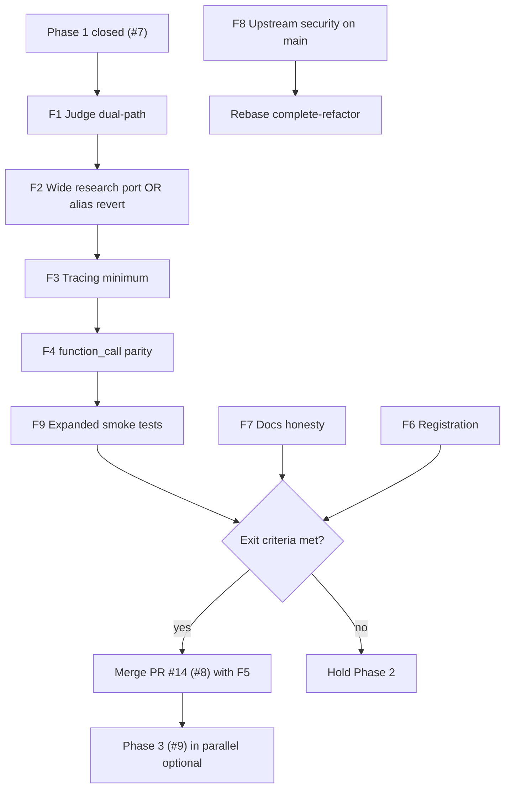

# PRD: Phase 1.5 — Pre-merge fix backlog (`complete-refactor`)

> **Status:** Draft / ready for execution  
> **Parent:** [#3 — Pydantic AI migration umbrella](https://github.com/BartmossMurphy2077/MCP-Universe-KINIT/issues/3)  
> **Evidence base:** Refactor audit ([`architecture_delta.md`](./architecture_delta.md), [`fork_evolution.md`](./fork_evolution.md), [`pr_analysis/`](./pr_analysis/)), conversation review (June 2026)  
> **Branch target:** `complete-refactor` (integration branch; **not** `main` until this PRD is substantially complete)

This document is the **actionable fix plan** before advancing to later migration stages (Phase 2 merge, Phase 3 MCP+ refactor, Phase 4 local LLMs). It separates work that must happen **now** from work **already scheduled** in open GitHub issues.

---

## Problem Statement

The fork has two live architectures: **`main`** (legacy stack + Azure, shipped) and **`complete-refactor`** (Pydantic AI registry swap, unmerged). Phase 0–1 landed quickly (~one week, June 2026) and closed child issues #6 and #7, but forensic review shows Phase 1 was **over-declared**:

- **Wide research** occupies the canonical `function_call_wide_research` alias with a stub — no parallel scheduler port.
- **Evaluator judges** call `ModelManager().build_model("azure")` → `PydanticAIBaseLLM`, which raises on `generate()` — judge-backed suites are likely broken on the refactor branch.
- **Tracing** emits one lossy `type: llm` record per `agent.run()` instead of per-turn/per-tool spans — MCP+ tracer analysis and debugging regress.
- **`function_call`** delegates iteration budget to Pydantic AI defaults; legacy `max_iterations`, step reminders, and callback parity are not wired.
- **PR #14** (Phase 2, closes #8) is open on `feat/8` while the above gaps remain — including Code Mode capability detection that misfires on Azure **deployment names**.

Meanwhile, the **migration tracker** and design docs in `my_docs/design/` describe Pydantic AI work that is not on the shipped `main` branch, and the fork has **not re-synced upstream** security fixes (upstream PRs #63 SSTI, #68/#69 sandbox auth — merged upstream, absent on fork).

Without a bounded fix phase, merging `complete-refactor` or PR #14 risks silent benchmark regressions (especially deep-research wide-research YAMLs and LLM-judge evaluators) while later phases (#9–#11) address different problems.

---

## Solution

Insert **Phase 1.5 — Pre-merge fixes** between closed Phase 1 and Phase 2 merge:

1. Fix **hard blockers** (judges, wide-research alias honesty, minimal tracing parity).
2. **Hold PR #14** until blockers pass judge-backed and wide-research smoke tests.
3. **Reconcile tracking** — reopen or supersede #7 for wide research; update migration tracker status table.
4. **Defer** work already owned by open issues #8–#11 where those issues will address it later (see matrix below).
5. Only then proceed with Phase 2 merge (#8 / PR #14), Phase 3 (#9), Phase 4 (#10).

**Strategic decision required once (not in this PRD):** confirm merge-vs-freeze for `complete-refactor` → `main`. This plan assumes merge is still the goal but **not until Phase 1.5 exit criteria pass**.

---

## Cross-reference: GitHub issues & PRs

### Fork tracker (`BartmossMurphy2077/MCP-Universe-KINIT`)

| ID | Title | State | Relationship to this PRD |
|----|-------|-------|---------------------------|
| **#3** | Umbrella PRD — Pydantic AI migration | OPEN | Parent; registry-swap decision stands; add Phase 1.5 as explicit gate before merge |
| **#6** | Phase 0 POC | CLOSED | Done; no reopen |
| **#7** | Phase 1 — react + wide research + providers | CLOSED | **Misleadingly closed** — wide research stub only; track Fix **F2** here or new child issue |
| **#8** | Phase 2 — Code Mode + context layer | OPEN | **Do not merge until Phase 1.5 exit**; PR #14 implements this |
| **#9** | Phase 3 — MCP+ PostProcessAgent on Pydantic AI | OPEN | **Later** — do not duplicate in Phase 1.5; context layer uses legacy MCP+ activation for now |
| **#10** | Phase 4 — local LLMs | OPEN | **Later** — Harmony/claude-wide pairing risks documented, not fixed here |
| **#11** | Phase 5 — LangChain remote sandbox | OPEN | **Deferred optional** — no action |
| **PR #14** | Phase 2 implementation | OPEN | Merge **after** F1–F4; fix Azure deployment capability gate **in PR #14 or F5** |
| **PR #13** | Phase 1 implementation | MERGED | Source of stub wide research |
| **PR #12, #5, #2** | POC + Azure | MERGED | Shipped on `main` / base of refactor |

### Upstream (`SalesforceAIResearch/MCP-Universe`) — re-sync, not feature work

| ID | Topic | Relevance |
|----|-------|-----------|
| **PR #63** | SSTI fix in prompt rendering (CWE-1336) | **F8** — cherry-pick/rebase onto fork `main` then merge into refactor |
| **PR #68, #69** | Sandbox auth / IDOR fixes | **F8** — same |
| **PR #67, #66, #64, …** | Benchmark cleanup, docs, Exa search | **Out of scope** unless fork explicitly wants upstream features |

### Upstream community issues (not fork-owned)

Issues #44–#65 on upstream are reproducibility, Blender, leaderboard, etc. **None block Phase 1.5** unless you choose to upstream-contribute separately.

---

## Actionable fix backlog (priority order)

Execute on **`complete-refactor`** unless noted. Each item maps to user stories and exit checks below.

| ID | Priority | Fix | Blocks | Already covered by issue? |
|----|----------|-----|--------|---------------------------|
| **F1** | P0 | **Judge dual-path:** evaluators must not resolve canonical `azure`/`openai`/`openrouter` to `PydanticAIBaseLLM`. Route judges to `*_legacy` providers **or** implement a real `generate()` / structured-output path on pydantic providers used only by judges. | Any LLM-judge evaluator (`google_search`, `deepresearch`, etc.) | **No** — gap not in #3–#11 |
| **F2** | P0 | **Wide research:** either (a) port parallel scheduler from legacy `FunctionCallWideResearch`, or (b) **revert canonical alias** to legacy until port is ready. Stub must not remain on `function_call_wide_research`. | `deepresearch/**/agent_wide_research_*.yaml` | **Partially #7** — closed prematurely |
| **F3** | P1 | **Tracing parity (minimum):** per-tool trace records through MCP adapter; per-iteration or per-request LLM traces where legacy had them; verify `BenchmarkReport.dump()` on multi-step run. | MCP+ tracer analysis, debugging | Umbrella US #5 — no child issue |
| **F4** | P1 | **`function_call` behavior parity:** wire `FunctionCallConfig.max_iterations` into Pydantic AI run limits; restore step reminders and callback hooks at tool boundaries where benchmarks depend on them. | Long-horizon function_call tasks | **No** |
| **F5** | P1 | **Code Mode capability gate (PR #14):** stop using model-name prefix allow-list alone; support Azure deployment names via config flag or provider metadata. | Phase 2 on Azure-primary fork | **#8 / PR #14** — fix before merge |
| **F6** | P2 | **Registration robustness:** restore deterministic agent/LLM registration (avoid import-order race after `agent/__init__.py` deletion). | New agent modules | **No** |
| **F7** | P2 | **Docs reconciliation:** mark migration tracker as “on `complete-refactor` only”; fix status table (wide research = stub, ReAct = backend swap). Design docs live in `my_docs/design/`. | Onboarding | **No** |
| **F8** | P2 | **Upstream security re-sync:** merge/cherry-pick #63, #68, #69 onto `main`, rebase `complete-refactor`. | Security | **No fork issue** |
| **F9** | P2 | **Test expansion:** judge-backed benchmark smoke + one wide-research task smoke (credential-gated); keep `tests/poc/` registry tests. | Merge confidence | Partially #7 acceptance criteria |
| **F10** | P3 | **Harmony / claude-wide:** document `TypeError` when pairing legacy agents with pydantic LLM aliases; migration deferred. | Mixed YAML | **Later** (no issue yet) |

### Explicitly **not** Phase 1.5 (handled later)

| Topic | Owner |
|-------|--------|
| MCP+ `PostProcessAgent` internal refactor onto Pydantic AI | **#9** |
| `vllm_local` / `sglang_local` providers | **#10** |
| LangChain remote sandboxes | **#11** (optional) |
| Full `summarize_tool_response` deprecation | Phase 2+ gradual (#8 scope) |
| RL / TITO / VERL / custom workflows | Umbrella out-of-scope |
| ReAct → native Pydantic AI tools | **Intentional** backend swap; relabel only (F7) |
| Benchmark score parity with legacy | Umbrella out-of-scope |

---

## Phase 1.5 exit criteria (gate before PR #14 merge & before `complete-refactor` → `main`)

- [ ] **F1:** `call_judge_text` / `call_judge_structured` succeed with default Azure env on refactor branch (unit or smoke).
- [ ] **F2:** Wide research YAML runs with **real** parallel behavior **or** alias reverted to legacy (documented).
- [ ] **F3:** Multi-step function_call run produces tool-level trace records; `BenchmarkReport.dump()` succeeds.
- [ ] **F4:** `max_iterations` honored (test: agent stops at configured limit).
- [ ] **F5:** Code Mode strategy resolves correctly for Azure deployment name used in benchmark YAML.
- [ ] **F9:** At least one judge-backed task + one wide-research task pass smoke (skipif credentials).
- [ ] **F7:** Migration tracker + `my_docs` reflect honest status.

---

## User Stories

1. As a **framework maintainer**, I want evaluator judges to call LLMs through a path that supports `generate()` and structured output, so that LLM-as-judge suites work on the refactor branch without forcing agents and judges to share incompatible provider classes.

2. As a **framework maintainer**, I want the canonical `function_call_wide_research` alias to either run the real parallel scheduler or point at legacy explicitly, so that deep-research benchmarks do not silently degrade to single-threaded function_call.

3. As a **benchmark operator**, I want trace files to include tool-level (and reasonably granular LLM) records, so that MCP+ tracer analysis and historical report tooling remain usable after migration.

4. As a **benchmark operator**, I want `max_iterations` and step reminders on function_call agents to behave like legacy unless we explicitly document a breaking change, so that long-horizon task scores remain comparable.

5. As a **benchmark operator running Azure**, I want Code Mode capability detection to work with Azure deployment names, so that Phase 2 context strategy does not always fall back incorrectly on our primary provider.

6. As a **contributor adding a new agent**, I want registry registration to be deterministic without import-order hacks, so that alias swaps do not break when module load order changes.

7. As a **new contributor reading docs on `main`**, I want design documents to state which architecture they describe, so that I do not assume Pydantic AI is shipped when I am on the Azure-only branch.

8. As a **security-conscious operator**, I want upstream SSTI and sandbox auth fixes merged into the fork, so that we do not carry known CVE-class regressions while refactoring agents.

9. As a **contributor writing tests**, I want smoke tests for judge-backed evaluators and wide-research tasks on the refactor branch, so that Phase 1.5 fixes are regression-protected at the BenchmarkRunner seam.

10. As a **project lead**, I want PR #14 held until Phase 1.5 exit criteria pass, so that we do not stack Code Mode on top of broken judges and a stub wide-research alias.

11. As a **project lead**, I want issue #7’s closure reconciled with actual wide-research status, so that the issue tracker reflects reality for AFK agents.

12. As a **research engineer**, I want ReAct honestly labeled as a legacy-protocol backend swap, so that we do not invest in “native tool migration” for ReAct prematurely.

13. As a **research engineer using Harmony or claude-wide agents**, I want documented pairing rules with pydantic LLM aliases, so that I use `*_legacy` LLMs until those agents migrate.

14. As a **downstream integrator**, I want the Executor → `AgentResponse` contract preserved while fixes land, so that FastAPI and pipeline integrations remain stable.

15. As a **context-cost owner**, I want MCP+ fallback in Phase 2 to keep using the existing wrapper activation path until #9 refactors PostProcessAgent, so that Phase 1.5 does not scope-creep into MCP+ internals.

16. As a **local LLM user**, I accept that vllm/sglang migration waits for #10, so that Phase 1.5 stays bounded.

17. As a **maintainer merging to `main`**, I want a explicit go/no-go on two-architecture drift, so that we either merge `complete-refactor` or freeze it with clear docs.

18. As a **contributor**, I want fix work split into small PRs (F1, F2, F3…) targeting `complete-refactor`, so that review stays incremental like Phase 0–1.

19. As a **benchmark operator**, I want `financial_analysis` JSON-evaluator smoke to remain green, so that the Phase 0 POC signal is not lost while expanding tests.

20. As a **contributor writing tests**, I want external-behavior tests at the BenchmarkRunner seam, not assertions on Pydantic AI internals, so that tests survive framework upgrades.

---

## Implementation Decisions

### F1 — Judge dual-path (recommended approach)

**Decision:** Judges and agents are different consumers of `ModelManager`. Judges require synchronous `generate()` with optional `response_format`; agents require `build_pydantic_ai_model()` + async `Agent.run()`.

**Preferred fix:** In the shared judge helper, resolve providers to **legacy aliases** (`azure_legacy`, `openai_legacy`, `openrouter_legacy`) for judge construction only. Agents keep canonical pydantic aliases. No YAML changes.

**Alternative:** Implement `generate()` on pydantic provider wrappers using the same AsyncOpenAI client (more code, single alias — only if legacy deprecation timeline demands it).

**Do not:** Leave canonical `azure` pointing at `PydanticAIBaseLLM` for judges — current state raises `NotImplementedError`.

### F2 — Wide research

**Decision:** Issue #7 acceptance criteria required “preserving scheduler/parallel tool-calling behavior.” PR #13 explicitly deferred this but swapped the alias.

**Preferred fix:** Port the parallel scheduler from legacy wide research into a Pydantic-AI-backed implementation (native tools + parallel fan-out preserved). Reuse MCP tool adapter.

**Fallback (fast):** Revert canonical alias to legacy class; pydantic stub uses a non-canonical alias or is deleted until port ready.

### F3 — Tracing

**Decision:** Emit legacy-shaped records at existing boundaries: `type: tool` from MCP adapter on each `call_tool`; `type: llm` per agent turn where feasible without rewriting Pydantic AI internals. Goal: `BenchmarkReport` and FileCollector consumers unchanged.

**Not in scope:** Full message-level OpenAI transcript replay inside traces.

### F4 — Function call parity

**Decision:** Pass iteration limits via Pydantic AI agent run configuration where supported; otherwise document explicit breaking change and keep legacy alias as escape hatch.

**ReAct:** No change to text/JSON protocol (umbrella + audit agree this is intentional).

### F5 — Code Mode capability (PR #14)

**Decision:** Replace prefix-only model name check with layered resolution: explicit YAML `context_layer.mode`, optional `code_mode_capable: true` in LLM config, then heuristic on model name, then default `direct`/`mcp_plus`.

### F6 — Registration

**Decision:** Prefer explicit registration module imported from `agent/manager.py` and `llm/manager.py` over relying on side-effect imports from scattered pydantic_ai modules.

### Branching

- All fixes target **`complete-refactor`** (or feature branches → `complete-refactor`).
- **`main`** receives only F8 security cherry-picks until merge decision.
- **PR #14:** rebase after F1–F4; merge only after exit criteria.

---

## Testing Decisions

### Principles

- Test **external behavior** at the **highest seam**: `BenchmarkRunner.run()` → evaluation results + trace collector + `BenchmarkReport.dump()`.
- Do not assert Pydantic AI internal call graphs, Agent construction counts, or harness internals.
- Gate live LLM tests with credential `skipif` (pattern from `tests/poc/test_benchmark_financial_analysis.py`).
- Prefer one deterministic task + one judge-backed task + one wide-research task over many unit mocks.

### Seams under test (proposed — confirm before implementation)

| Seam | Behavior | Prior art | Fix item |
|------|----------|-----------|----------|
| **Judge helper → ModelManager** | `call_judge_text` returns non-empty string; structured judge returns parsed model | `tests/evaluator/` patterns on `main` | F1 |
| **BenchmarkRunner + judge evaluator** | Task with LLM judge reports pass/fail without `NotImplementedError` | `web_search.yaml` tasks (credential-gated) | F1, F9 |
| **BenchmarkRunner + wide research** | Parallel tool behavior observable (timing or call pattern) or legacy alias explicitly selected | `deepresearch/**/agent_wide_research_*.yaml` | F2, F9 |
| **BenchmarkRunner + function_call** | Multi-step run respects `max_iterations`; trace has tool records | `tests/agent/test_function_call.py`, poc financial | F3, F4 |
| **Registry resolution** | Canonical vs `*_legacy` aliases resolve as documented | `tests/poc/test_workflow_azure_registry.py` | F1, F7 |
| **Context strategy** | Azure deployment selects expected strategy | `tests/poc/test_context_layer.py` (PR #14) | F5 |
| **BenchmarkReport** | `dump()` after migrated agent run | poc financial smoke | F3 |

### New tests (minimum)

1. Judge smoke — no live LLM optional mock, or live with `AZURE_API_KEY`.
2. Wide-research registry + behavior — fails today if stub alias claims canonical name without parallel semantics.
3. Trace shape — FileCollector contains `type: tool` after multi-tool function_call run.

---

## Out of Scope

- Full wide-research Claude variant port (`function_call_wide_claude`) unless bundled with F2 by explicit choice.
- MCP+ PostProcessAgent rewrite (**#9**).
- Local LLM providers (**#10**).
- LangChain sandboxes (**#11**).
- Harmony / claude-wide agent migration (document only in F10).
- Merging PR #14 before Phase 1.5 exit criteria.
- Merging `complete-refactor` to `main` without exit criteria + explicit lead decision.
- Benchmark score parity guarantees vs legacy agents.
- Upstream feature PRs (#64 Exa, #67 benchmark cleanup) unless separately prioritized.
- Fixing upstream community reproducibility issues (#44–#46, etc.).

---

## Further Notes

### Recommended execution order

### Migration tracker corrections (for `intermediary-readme-pydantic-ai-poc.md`)

| Row | Current label | Honest label |
|-----|---------------|--------------|
| Wide research | “Minimal adapter” / Done | **Stub — not migrated** (F2) |
| ReAct | Done | **Done — backend swap, legacy protocol** |
| Phase 1 PR #13 | Open (on main copy) | **Merged** |
| Phase 2 | Not started | **PR #14 open — blocked on Phase 1.5** |

### Relationship to audit docs

- [`architecture_delta.md`](./architecture_delta.md) §6–7 — divergence risks this PRD mitigates.
- [`pr_analysis/PR_13_pydantic_ai_providers_agents.md`](./pr_analysis/PR_13_pydantic_ai_providers_agents.md) — wide research “high risk” callout → F2.
- [`pr_analysis/PR_14_code_mode_context_layer.md`](./pr_analysis/PR_14_code_mode_context_layer.md) — Azure deployment gate → F5.

### Open question for project lead

**Merge vs freeze:** If wide research port (F2) is larger than one sprint, is alias revert to legacy acceptable for Phase 1.5 exit, with full port tracked as a new issue?

---

## GitHub tracking

| Item | Link |
|------|------|
| **Phase 1.5 umbrella issue** | [#15 — Pre-merge fix backlog](https://github.com/BartmossMurphy2077/MCP-Universe-KINIT/issues/15) (`ready-for-agent`) |
| Parent PRD | [#3](https://github.com/BartmossMurphy2077/MCP-Universe-KINIT/issues/3) |
| Phase 2 (blocked) | [#8](https://github.com/BartmossMurphy2077/MCP-Universe-KINIT/issues/8) / [PR #14](https://github.com/BartmossMurphy2077/MCP-Universe-KINIT/pull/14) |
| Phase 1 closure note | [#7 comment](https://github.com/BartmossMurphy2077/MCP-Universe-KINIT/issues/7) — wide research incomplete |

**Optional follow-up:** file upstream security re-sync issue for F8 (#63, #68, #69).
