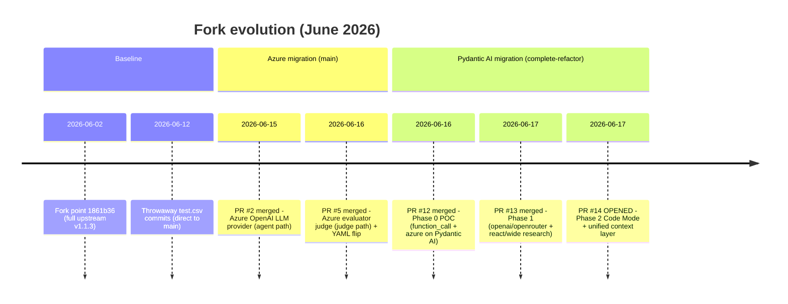
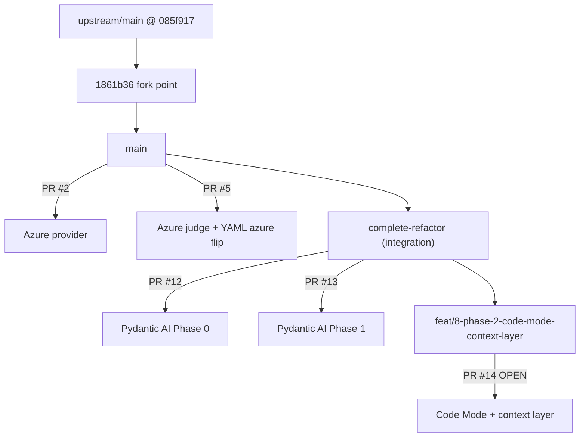
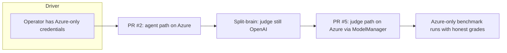
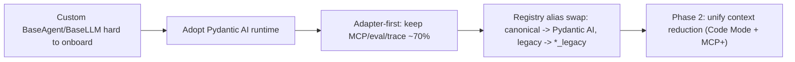
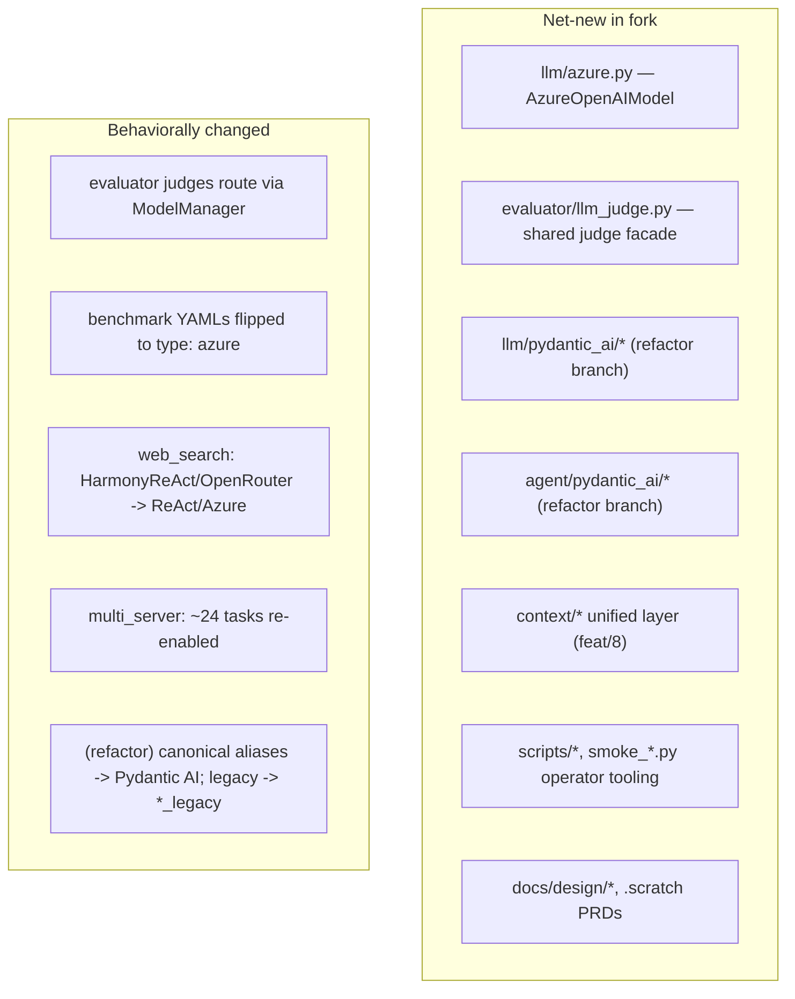
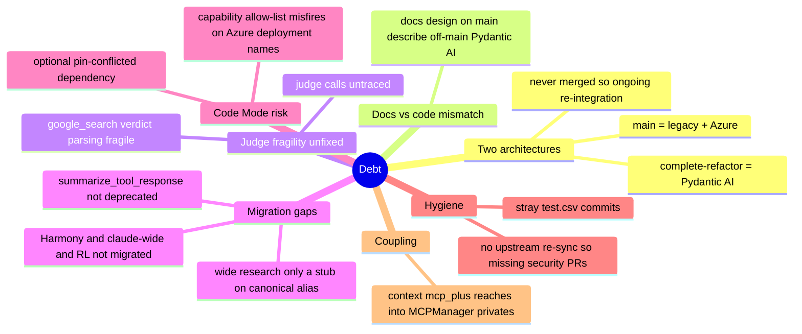

# Fork Evolution — MCP-Universe-KINIT

> Forensic reconstruction of how this fork (`BartmossMurphy2077/MCP-Universe-KINIT`) diverged from upstream `SalesforceAIResearch/MCP-Universe`.
> All claims are git-verified; inferred motivations carry an explicit confidence level.
> Companion docs: [`architecture_delta.md`](./architecture_delta.md), [`pr_analysis/`](./pr_analysis/).

---

## 1. Provenance

| Fact | Value |
|------|-------|
| Upstream | `SalesforceAIResearch/MCP-Universe` (`mcpuniverse` v1.1.3, Apache-2.0) |
| Fork remote | `BartmossMurphy2077/MCP-Universe-KINIT` |
| Merge-base | `1861b36` "Upload required SECURITY.md file for compliance" (Salesforce OSPO bot, 2026-06-02) |
| Upstream HEAD at fork | `085f917` (Merge PR #58 `dev-ziji`, veRL integration) |
| Upstream re-syncs since | **None** |

The fork froze on the upstream codebase in early June 2026 and has evolved independently since. Everything below is fork-only work.

---

## 2. Chronological timeline

Two distinct, sequential initiatives in a single week:

1. **Azure migration** — landed on `main`. Makes the framework runnable on Azure OpenAI end-to-end (agent + judge).
2. **Pydantic AI / LangChain migration** — staged on `complete-refactor` (+ `feat/8`). Re-platforms the agent/LLM runtime onto OSS frameworks. **Not merged to `main`.**

---

## 3. Branch & PR map

| PR | Title | Base | State | Theme |
|----|-------|------|-------|-------|
| #2 | Add Azure OpenAI LLM provider | `main` | Merged | Azure |
| #5 | Azure evaluator judge | `main` | Merged | Azure |
| #12 | Phase 0: Pydantic AI POC | `complete-refactor` | Merged | OSS migration |
| #13 | Phase 1: providers + agents | `complete-refactor` | Merged | OSS migration |
| #14 | Phase 2: Code Mode + context layer | `complete-refactor` | **Open** | OSS migration |

Detailed per-PR analysis in [`pr_analysis/`](./pr_analysis/).

---

## 4. Architectural themes

### Theme A — "Make it run on Azure" (delivered on `main`)

The Azure work follows the framework's own grain: subclass `BaseLLM`, register an alias (`./technical_breakdown.md` §18), and unify the judge behind `ModelManager` (the exact recommendation in `./llm_judge.md` §12). It also threaded Azure creds through MCP+ proxying so remote servers work. **Confidence: High** the motivation is credential consolidation / cost / compliance (PRD + smoke scripts + README).

### Theme B — "Re-platform onto OSS frameworks" (staged on `complete-refactor`)

Motivation (design doc + PRD): maintainability over benchmark parity. Strategy: **adapter-first**, swapping the agent loop and LLM factory while preserving the MCP client, benchmark runner, evaluators, env_pool, and tracing behind thin adapters. **Confidence: High.**

### Theme C — Windows / operator ergonomics

PowerShell run scripts (`scripts/run_*.ps1`), Python smoke tests (`smoke_azure.py`, `smoke_notion.py`, `smoke_blender.py`), `.cursor/mcp.json`, and `.gitignore` agent-skill entries indicate a **Windows-based operator** running overnight batches. This explains `python3`-on-Windows friction noted in `./technical_breakdown.md` §20 and the per-suite credential gating in the PRD.

---

## 5. Key divergences from upstream

| Area | Upstream | Fork `main` | Fork `complete-refactor` |
|------|----------|-------------|--------------------------|
| Agent runtime | Custom `BaseAgent` loops | Same | **Pydantic AI** behind aliases |
| LLM providers | ~15 `BaseLLM` subclasses, no Azure | + `AzureOpenAIModel` | + `PydanticAI{OpenAI,OpenRouter,Azure}Model`; legacy → `*_legacy` |
| Evaluator judges | Direct `openai.OpenAI`, hardcoded models | **Via `ModelManager`**, provider auto-detect | Same as main |
| Context reduction | MCP+, summarize, SafeCodeExecutor (uncoordinated) | Same | + unified `ContextStrategy` selector + Code Mode (feat/8) |
| Benchmark YAML providers | `openai`/`openrouter` | `azure` | `azure` |
| Operator tooling | Minimal | PowerShell batch + smoke scripts | inherited |

---

## 6. Important decisions (with confidence)

| Decision | Evidence | Confidence |
|----------|----------|-----------|
| Azure as **explicit opt-in** (no silent OpenAI→Azure) | PR #2 body; PRD Out-of-Scope | High |
| Judge provider **auto-detects Azure** when creds present | `llm_judge.resolve_judge_config` | High |
| Web search uses **ReAct + Azure**, not Harmony (Azure lacks `reasoning`) | `web_search.yaml` diff; PRD pitfalls | High |
| Pydantic AI migration via **registry alias swap**, not WorkflowBuilder routing | `*_legacy` alias diffs | High (note: diverges from design doc which proposed WorkflowBuilder routing) |
| Migration staged on `complete-refactor`, merged to `main` only "when complete" | PR #12 body | High |
| ReAct migrated as **backend swap** (keeps legacy text protocol), not native tool calling | `pydantic_ai/react.py` | High |
| Code Mode behind **optional** `pydantic-ai-harness[code-mode]` extra | PR #14 body; `code_mode.py` | High |

---

## 7. Technical debt introduced

| Debt | Where | Risk |
|------|-------|------|
| Two divergent runtimes, unmerged | `main` vs `complete-refactor` | High — maintenance & drift |
| Docs describe unbuilt-on-`main` features | `docs/design/*` on `main` | Medium — onboarding confusion |
| Wide research stub on canonical alias | `pydantic_ai/function_call_wide_research.py` | High — deep-research suites |
| Code Mode capability gate vs Azure deployment names | `context/layer.py` | High on fork's primary provider |
| Fragile judge verdict parsing, untraced judges | `evaluator/google_search` | Medium |
| No upstream sync (missing security PRs #63/#68/#69) | branch topology | Medium |
| Per-call client construction, import-time config defaults | `llm/azure.py` | Low |
| Registration-order dependence after `agent/__init__.py` deletion | `agent/manager.py` (refactor) | Medium |

---

## 8. Areas requiring future cleanup (recommended order)

1. **Decide the runtime story.** Either finish + merge `complete-refactor` into `main`, or freeze it. The two-architecture state is the dominant risk.
2. **Reconcile docs with `main`.** Mark `docs/design/*` as "future / on refactor branch" so readers of `main` aren't misled.
3. **Finish wide research** before it ships on the canonical alias, or revert that alias to legacy until ported.
4. **Fix Code Mode capability detection** for Azure deployment names (don't rely on model-name prefixes), and resolve the harness pin conflict before treating Code Mode as real.
5. **Harden the judge** — structured-output parsing for `google_search` (mirror `deepresearch`), and trace judge calls (PRD User Story 28).
6. **Re-sync with upstream** to pick up post-June security fixes, then re-base the fork's deltas.
7. **Remove hygiene noise** (`test.csv`).

---

## 9. One-paragraph mental model

This fork took upstream MCP-Universe v1.1.3 (frozen early June 2026) and pursued **two migrations in one week**. On `main`, a clean **Azure migration** (PRs #2, #5) added an Azure provider and re-routed the LLM-as-judge evaluators through `ModelManager`, making Azure-only benchmark runs work with honest grading — strongly-justified, framework-idiomatic work. In parallel, on the unmerged `complete-refactor` branch, an **adapter-first Pydantic AI re-platforming** (PRs #12, #13, and open #14) swapped the custom agent/LLM runtime for Pydantic AI behind transparent registry aliases while keeping the MCP, evaluation, and tracing layers intact — a sound strategy whose execution still has real gaps (stubbed wide research, lossy tracing, Azure-incompatible Code Mode capability detection) and, most importantly, has not landed on `main`. The result is a fork whose **shipped truth is "legacy + Azure"** and whose **documented future is "Pydantic AI + Code Mode"**, with the gap between them being the principal thing a new engineer must understand.
