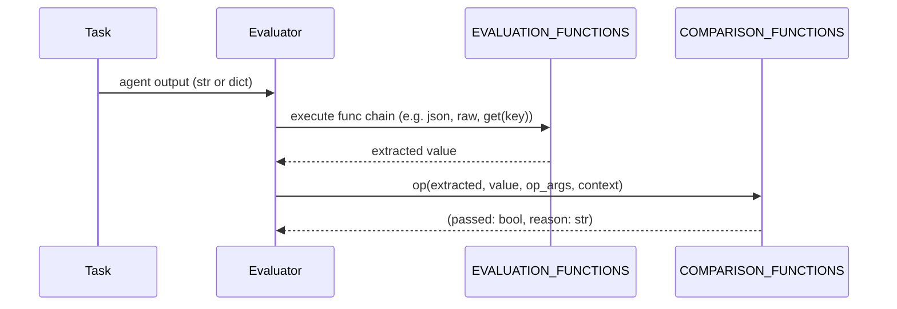
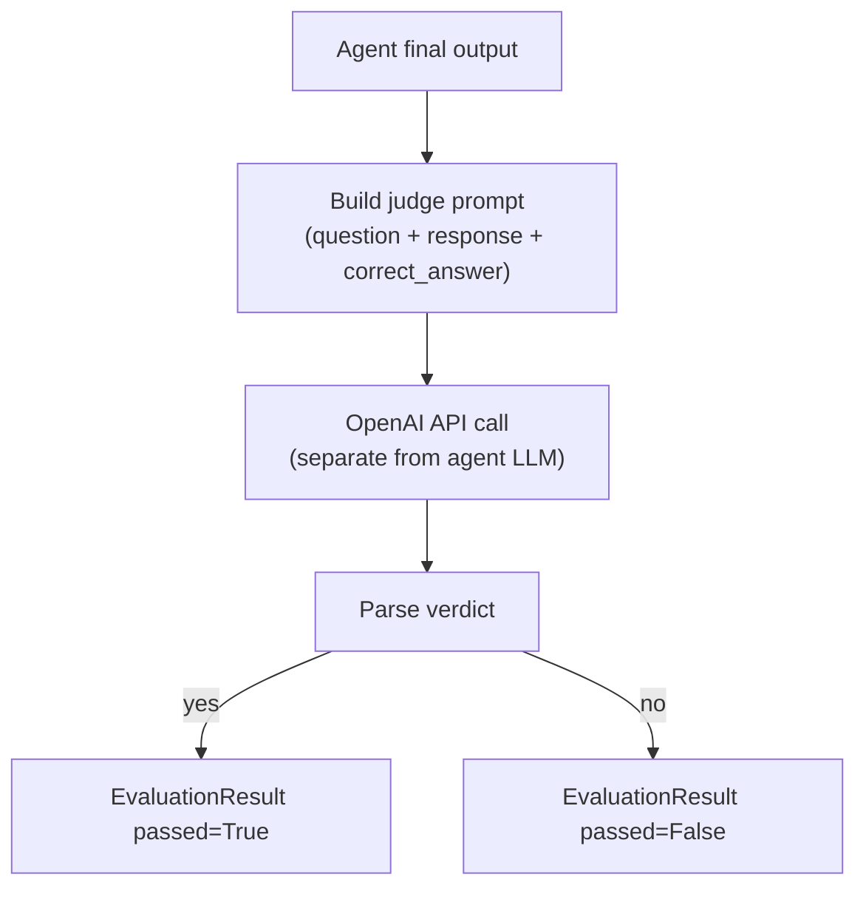
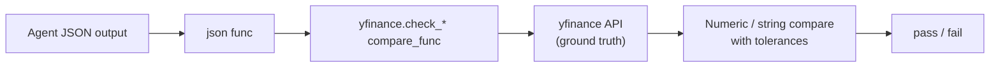
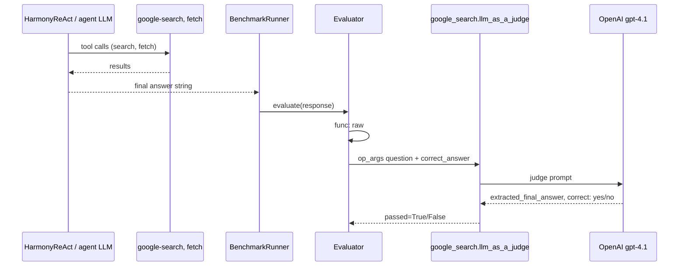
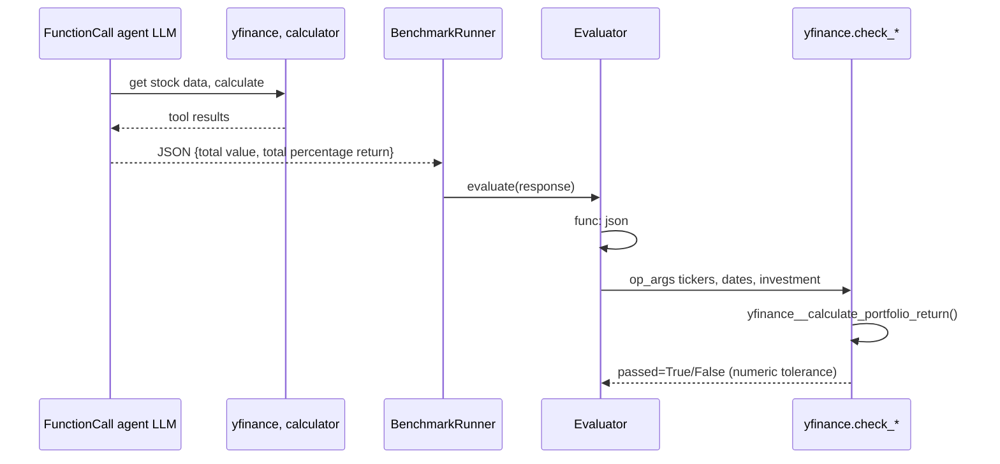

# LLM-as-a-Judge in MCP-Universe

Analysis of where and how LLM judges are used for **benchmark evaluation** (scoring agent outputs), how that differs from **deterministic evaluators** (e.g. yfinance), and what extra LLM calls you might see during a run that are **not** judges.

---

## 1. Executive summary

| Question | Answer |
|----------|--------|
| Does `financial_analysis` use an LLM judge? | **No.** All 40 yfinance tasks use deterministic `yfinance.*` comparison functions. |
| Where are LLM judges implemented? | Exactly **two** `@compare_func` handlers in `mcpuniverse/evaluator/`. |
| Where are they used in shipped task JSON? | **50** `web_search/info_search_task_*.json` tasks (`google_search.llm_as_a_judge`). |
| Where else? | **Deep Research** benchmarks (GAIA, HLE, BrowseComp) — tasks are **generated** at prep time with `deepresearch.hle_llm_as_a_judge` (no task JSON committed to the repo). |
| Does yfinance use deterministic checks? | **Yes** — Python functions re-fetch market data via `yfinance` and compare numerically with tolerances. |

If you saw extra LLM API traffic while running `financial_analysis`, it almost certainly came from the **agent** (multi-turn `FunctionCall` reasoning), not from the evaluator. See [§8 Why you might have seen “a judge” during financial_analysis](#8-why-you-might-have-seen-a-judge-during-financial_analysis).

---

## 2. How evaluation works (foundation)

Every task defines one or more evaluators. Each evaluator is an expression:

```text
func(...)  op  value
```

Implemented in `mcpuniverse/evaluator/evaluator.py`:



**Two registries** (`mcpuniverse/evaluator/functions.py`):

| Registry | Decorator | Role | Examples |
|----------|-----------|------|----------|
| `EVALUATION_FUNCTIONS` | `@eval_func` | Transform agent output | `json`, `raw`, `get`, `foreach` |
| `COMPARISON_FUNCTIONS` | `@compare_func` | Score extracted value | `=`, `contain`, `yfinance.check_portfolio_task_output`, **`google_search.llm_as_a_judge`** |

**LLM judges live only in `COMPARISON_FUNCTIONS`** — they run *after* the func chain, when deciding pass/fail.

Typical task JSON shapes:

```json
// Deterministic (financial_analysis)
{
  "func": "json",
  "op": "yfinance.check_portfolio_task_output",
  "op_args": { "tickers": ["MSFT"], "start_date": "...", ... }
}

// LLM judge (web_search)
{
  "func": "raw",
  "op": "google_search.llm_as_a_judge",
  "op_args": {
    "question": "...",
    "correct_answer": "Ollie Watkins"
  }
}
```

- `func: "raw"` — pass agent output through unchanged (string or dict).
- `func: "json"` — parse agent JSON first, then compare structured fields.

---

## 3. The two LLM judge implementations

Only these files call OpenAI **inside the evaluator layer**:

| File | Compare op name | Model (default) | API style |
|------|-----------------|-----------------|-----------|
| `evaluator/google_search/functions.py` | `google_search.llm_as_a_judge` | `gpt-4.1` | `chat.completions.create` (free-form text) |
| `evaluator/deepresearch/functions.py` | `deepresearch.hle_llm_as_a_judge` | `o3-mini-2025-01-31` | `beta.chat.completions.parse` (structured Pydantic) |

Both are registered when `mcpuniverse/evaluator/__init__.py` imports those modules.



### 3.1 `google_search.llm_as_a_judge`

**Location:** `mcpuniverse/evaluator/google_search/functions.py`

**Prompt template** (`google_search__get_judge_prompt`): asks the model to:

1. Extract `extracted_final_answer` from the agent response
2. Compare against `correct_answer` with reasoning
3. Output `correct: yes` or `correct: no` (numeric answers allow small margin of error)

**API call** (`google_search__call_gpt`):

- Client: `openai.OpenAI(api_key=context.get_env("OPENAI_API_KEY"))`
- Model: `gpt-4.1` (hardcoded default)
- Temperature: `0.0`
- Retries: up to 5 attempts on API errors

**Verdict parsing** (fragile string split):

```python
judge = response.split("correct:")[1].strip()
if "yes" in judge:
    return True, ""
```

**Invocation** (`google_search__llm_as_a_judge`):

- Takes agent output + `op_args` (`question`, `correct_answer`)
- Up to 3 outer retries on parse/logic errors
- Uses `Context` from evaluator for API key (falls back to env via `context.get_env`)

### 3.2 `deepresearch.hle_llm_as_a_judge`

**Location:** `mcpuniverse/evaluator/deepresearch/functions.py`

Based on the **HLE / BrowseComp official grading approach** (see comment referencing [arxiv:2501.14249](https://arxiv.org/html/2501.14249v1)).

**Prompt:** Same conceptual structure as google_search, plus a required `confidence` field (0–100).

**Structured output** via Pydantic model `HLEExtractedAnswer`:

```python
class HLEExtractedAnswer(BaseModel):
    extracted_final_answer: str
    reasoning: str
    correct: Literal["yes", "no"]
    confidence: int
    strict: Literal[True] = True
```

**API call** (`deepresearch__call_gpt_hle`):

- Client: `openai.OpenAI(api_key=os.getenv("OPENAI_API_KEY"))` — **note:** uses `os.getenv` directly, not `Context`
- Model: `o3-mini-2025-01-31` (hardcoded)
- `max_completion_tokens=4096`
- Retries: up to 5 attempts

**Verdict:**

```python
if response.correct == "yes":
    return True, ""
```

More reliable than the string-split approach in google_search.

---

## 4. Where LLM judges are used

### 4.1 Web search benchmark (committed tasks)

| Benchmark YAML | Tasks using LLM judge | Other evaluators in same benchmark |
|----------------|----------------------|-----------------------------------|
| `benchmark/configs/mcpuniverse/web_search.yaml` | **50** × `info_search_task_0001.json` … `0050.json` | Multi-server Notion tasks use **deterministic** `notion.compare_page_text` |

Every `info_search_task_*.json` follows this pattern:

```json
"evaluators": [{
  "func": "raw",
  "op": "google_search.llm_as_a_judge",
  "op_args": {
    "question": "<same as task question>",
    "correct_answer": "<single ground-truth string>"
  }
}]
```

**Why LLM judge here?** Web-search answers are natural-language facts (“Ollie Watkins”, a date, a place name). Exact string match is too brittle; the judge allows paraphrase and extracts the final answer from verbose agent output.

`web_search.yaml` also sets `summarize_tool_response: true` on the agent — that causes **additional agent-side LLM calls** (not the judge). See §8.

### 4.2 Deep Research benchmarks (generated tasks)

| Component | Path | LLM judge op |
|-----------|------|--------------|
| Task builder | `benchmark/configs/deepresearch/data_utils.py` | `evaluator_op="deepresearch.hle_llm_as_a_judge"` (default in `build_task_config`) |
| Prep script | `benchmark/configs/deepresearch/prepare_deep_research_data.py` | Generates JSON under `benchmark/configs/deepresearch/<dataset>/` |
| Benchmark YAMLs | `deepresearch/configs/{gaia,hle,browsecomp}/agent_wide_research_*.yaml` | Point at generated task files |

Datasets: **GAIA**, **HLE** (`cais/hle`), **BrowseComp** (`smolagents/browse_comp`).

Generated task template (`build_task_config`):

```python
"evaluators": [{
    "func": "raw",
    "op": evaluator_op,  # default: deepresearch.hle_llm_as_a_judge
    "op_args": {
        "question": question,
        "correct_answer": correct_answer
    }
}]
```

**No generated task JSON is checked into the repo** — you must run the data-prep script first. After prep, every Deep Research task uses the HLE LLM judge.

### 4.3 Benchmarks that do **not** use LLM judges

Confirmed by codebase search — **zero** `llm_as_a_judge` / `hle_llm_as_a_judge` references in:

| Benchmark area | Evaluator style | Example ops |
|----------------|-----------------|-------------|
| **financial_analysis** (40 tasks) | Deterministic + live yfinance | `yfinance.check_portfolio_task_output`, `yfinance.check_net_income`, … |
| location_navigation | Deterministic | `google_maps.validate_places`, `google_maps.city_name_match`, … |
| browser_automation | Deterministic | `playwright.check_flight_price`, `playwright.is_dict_equal`, … |
| repository_management | Deterministic | GitHub API checks in `evaluator/github/` |
| 3d_design / blender | Deterministic | `blender.check_file`, `blender.check_file_content` |
| mcpmark (notion, github, postgres, filesystem, playwright) | Deterministic Python verifiers | `mcpmark.notion.verify_*`, `postgres_*_verifier`, … |
| multi_server (Notion combo tasks) | Deterministic | `notion.compare_page_text` with fixed `value` string |
| dummy / weather | Deterministic | `=`, `weather.check_place_type_with_weather` |

---

## 5. Deterministic evaluation: yfinance example (financial_analysis)

Your intuition is correct: yfinance tasks **do not** use an LLM judge. They use Python functions that:

1. Parse the agent’s JSON output
2. **Recompute ground truth** by calling `yfinance` (and sometimes `calculator` logic inline)
3. Compare with numeric tolerances

Example from `yfinance_task_0001.json`:

```json
{
  "func": "json",
  "op": "yfinance.check_portfolio_task_output",
  "op_args": {
    "tickers": ["MSFT"],
    "start_date": "2023-01-09",
    "end_date": "2025-01-08",
    "initial_investment": 25000.0,
    "split": [1.0]
  }
}
```

Core logic (`evaluator/yfinance/functions.py` → `check_portfolio_task_output`):

```python
expected_final_value, expected_percentage_return = yfinance__calculate_portfolio_return(...)
# tolerances: final_value ±0.5, percentage_return ±0.05
if abs(user_final_value - expected_final_value) > final_value_tolerance:
    return False, "Value error ..."
```



**Important:** The evaluator may still hit **external APIs** (Yahoo Finance via `yfinance` library) — but that is **not** an LLM call.

All 25+ `yfinance.*` compare functions in `evaluator/yfinance/functions.py` follow this pattern (margins, holdings, signals, etc.).

---

## 6. Side-by-side: LLM judge vs deterministic

| Aspect | LLM judge (`google_search` / `deepresearch`) | Deterministic (`yfinance`, `google_maps`, …) |
|--------|-----------------------------------------------|-----------------------------------------------|
| **Ground truth** | String in `op_args.correct_answer` | Computed in Python or fixed `value` in JSON |
| **Comparison** | Second LLM reads question + agent output | Code: `==`, tolerances, API verification |
| **Cost** | +1 OpenAI call per evaluator per task | API/tool cost only (yfinance, GitHub, Notion, …) |
| **Determinism** | Non-deterministic (model variance) | Reproducible given same market data |
| **API key** | `OPENAI_API_KEY` (evaluator-side) | Domain keys (e.g. `NOTION_API_KEY`) |
| **Best for** | Open-ended factual QA, paraphrased answers | Numeric, structured, or verifiable state |

---

## 7. Evaluation flow diagrams

### LLM judge path (web_search task)



### Deterministic path (financial_analysis task)



---

## 8. Why you might have seen “a judge” during financial_analysis

`financial_analysis.yaml` has **`summarize_tool_response: false`** and evaluators are **100% deterministic**. Extra LLM activity during that benchmark is from other sources:

| Source | Layer | When | LLM? |
|--------|-------|------|------|
| **FunctionCall agent** | Agent | Every reasoning step (up to `max_iterations: 20`) | Yes — configured agent LLM (`gpt-4.1` / your Azure model) |
| **Tool response summarizer** | Agent | Only if `summarize_tool_response: true` | Yes — same agent LLM |
| **MCP+ PostProcessAgent** | Extension | Only if using `mcp-build-plus` / wrapper YAML | Yes — separate cheap LLM |
| **`jina-scrape-llm-summary` MCP server** | Tool server | Deep Research / web pipelines using that server | Yes — `SUMMARY_LLM_*` env vars |
| **Evaluator LLM judge** | Evaluator | **Never** for financial_analysis | No |
| **BenchmarkReport trace analysis** | Reporting | Classifies trace records as `llm_thought` vs `llm_summary` | No API call — reads traces only |

**Most likely explanation:** traces / logs showing many `llm` records are the **agent’s** multi-turn loop, not an evaluator judge. The report code in `benchmark/report.py` labels trace types and increments `llm_call_count` for all agent LLM invocations.

To confirm on a run, check evaluation results:

```text
op: yfinance.check_portfolio_task_output   # deterministic
op: google_search.llm_as_a_judge           # would indicate LLM judge
```

---

## 9. Related LLM usage (not evaluator judges)

These use an LLM but are **not** the benchmark scoring “LLM-as-a-judge” pattern:

### 9.1 Agent tool summarization

- `BaseAgent.summarize_tool_response()` in `agent/base.py`
- Enabled in `web_search.yaml`, `multi_server.yaml`, `dummy/benchmark_1.yaml`
- **Disabled** in `financial_analysis.yaml`

### 9.2 Evaluator-Optimizer workflow

- `workflows/evaluator_optimizer.py` — one agent generates, another LLM **rates** quality in a refinement loop
- Used when you compose workflows in YAML, not in standard benchmark task JSON

### 9.3 MCP+ PostProcessAgent

- `extensions/mcpplus/` — compresses large tool outputs with a secondary LLM
- Optional wrapper around MCP servers, not the default financial benchmark

### 9.4 Jina scrape + LLM summary MCP server

- `mcp/servers/jina_scrape_llm_summary/server.py`
- Tool `scrape_and_extract_info` calls a separate summary LLM (`SUMMARY_LLM_BASE_URL`, `SUMMARY_LLM_MODEL_NAME`, `SUMMARY_LLM_API_KEY`)
- Used in Deep Research data prep default tools, not in financial_analysis

---

## 10. Configuration and environment

### LLM judge requirements

| Judge | Required env | Default model | Configurable? |
|-------|--------------|---------------|-------------|
| `google_search.llm_as_a_judge` | `OPENAI_API_KEY` (via `Context`) | `gpt-4.1` | Model passed via `**kwargs` to `call_gpt` but tasks don’t set it |
| `deepresearch.hle_llm_as_a_judge` | `OPENAI_API_KEY` (`os.getenv`) | `o3-mini-2025-01-31` | Hardcoded in `deepresearch__call_gpt_hle` |

**Separate from agent LLM:** The judge uses its **own** direct `openai.OpenAI` client — it does **not** go through `mcpuniverse.llm.ModelManager` or the agent’s Azure/OpenRouter config. Running financial_analysis with Azure for the agent does not automatically route judge calls to Azure.

### Failure behavior

- **google_search:** 5 API retries, 3 evaluation retries; failure → `passed=False` with reason `"output is not equal to ground-truth"` or `"ERROR: ..."`
- **deepresearch:** Same retry pattern; structured parse reduces ambiguous failures

---

## 11. Full inventory: `compare_func` ops in the codebase

**LLM-based (2):**

- `google_search.llm_as_a_judge`
- `deepresearch.hle_llm_as_a_judge`

**Deterministic domains (selection):**

- `yfinance.*` (25+ functions)
- `google_maps.*` (15+ functions)
- `playwright.*`, `notion.*`, `weather.*`, `blender.*`
- `mcpmark.*` (github, notion, filesystem, playwright, postgres — 50+ verifiers)
- Built-ins: `=`, `<`, `<=`, `>`, `>=`, `in`, `contain`

Grep proof — only two files contain `chat.completions` in `evaluator/`:

```text
evaluator/google_search/functions.py
evaluator/deepresearch/functions.py
```

---

## 12. Practical implications for refactoring

1. **Split agent LLM from judge LLM** — Judges bypass `ModelManager`; consider unifying behind `BaseLLM` for consistent providers (Azure, etc.).
2. **google_search judge parsing** — `split("correct:")` is brittle; deepresearch’s structured parse is the better pattern.
3. **Cost accounting** — Benchmark traces count agent LLM calls; judge calls are **not** separately tagged in `Tracer` (they happen inside compare functions without tracing).
4. **Adding a new LLM judge** — Implement `@compare_func(name="domain.my_judge")`, import in `evaluator/__init__.py`, reference `"op"` in task JSON.
5. **financial_analysis** — Safe to treat as fully deterministic for CI; no judge API key needed for scoring (agent LLM key still required).

---

## 13. Quick reference: file map

```text
mcpuniverse/evaluator/
├── evaluator.py              # Evaluator engine (func chain → compare op)
├── functions.py              # @eval_func + built-in @compare_func (=, in, …)
├── google_search/functions.py   # ★ google_search.llm_as_a_judge
├── deepresearch/functions.py    # ★ deepresearch.hle_llm_as_a_judge
└── yfinance/functions.py        # All deterministic financial checks

mcpuniverse/benchmark/configs/
├── mcpuniverse/web_search/info_search_task_*.json   # 50 × LLM judge
├── mcpuniverse/financial_analysis/yfinance_task_*.json  # 40 × deterministic
└── deepresearch/data_utils.py   # Generates tasks with HLE LLM judge
```

---

## 14. One-paragraph mental model

MCP-Universe has **exactly two** evaluator-level LLM judges, both following the “HLE-style” prompt: show the judge the question, the agent’s full response, and a reference answer, then ask whether they match. They are used for **open-ended factual QA** (web search tasks and Deep Research datasets). **Financial analysis and most other benchmarks** instead use **deterministic Python comparators** that parse JSON and check numbers, strings, or external system state. If you run `financial_analysis` and see many LLM calls, that is almost always the **agent** thinking and calling tools — not a hidden judge — unless you accidentally ran `web_search` or Deep Research tasks in the same session.
