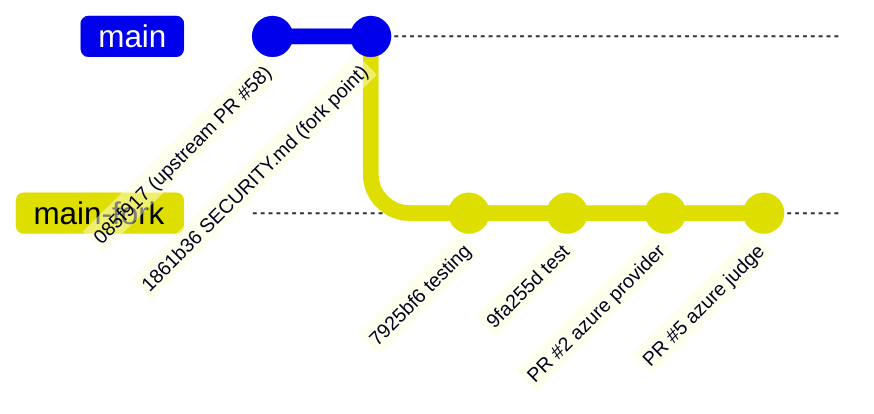
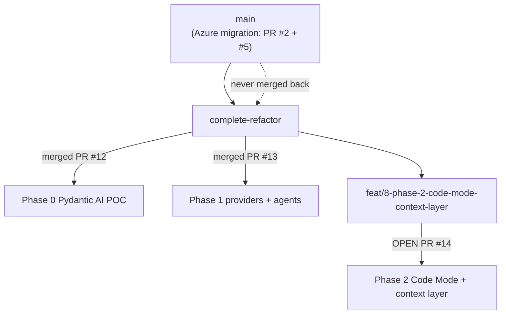
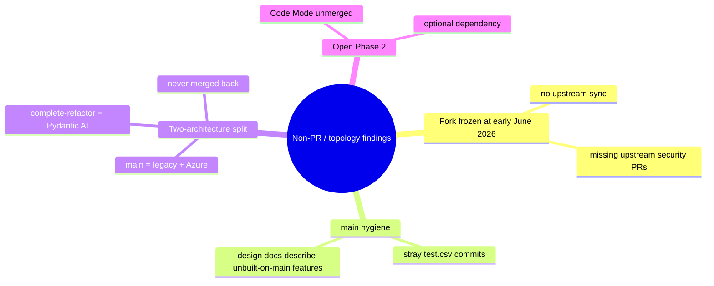

# Direct Change Analysis — Branch Topology & Non-PR Commits

> Phase 4 deliverable: architecturally significant changes that **bypassed `main` PR review** or were committed directly. Verified against git history (`git log`, `git merge-base`, branch diffs).
> Companion: [`../fork_evolution.md`](../fork_evolution.md), [`../architecture_delta.md`](../architecture_delta.md).

---

## 1. Fork point (merge-base with upstream)

* **Merge-base:** `1861b36` "Upload required SECURITY.md file for compliance" (author: *Salesforce OSPO Service Bot*, 2026-06-02). This is the last commit shared with `upstream/main`.
* Upstream `main` HEAD at fork time was `085f917` (Merge PR #58 `dev-ziji`, veRL integration).
* **Implication:** The fork carries the *entire* upstream codebase as of early June 2026 and has **not** pulled upstream changes since. Any later upstream work (open upstream PRs #59–#70, security fixes #63/#68/#69) is absent. **Confidence: High.**

---

## 2. Trivial direct-to-main commits (noise, not architecture)

| Commit | Message | Change | Verdict |
|--------|---------|--------|---------|
| `7925bf6` | "testing" | `test.csv` +1 line | Throwaway |
| `9fa255d` | "test" | `test.csv` −1 line | Throwaway (reverts the above) |

These were committed directly to `main` before PR #2, outside any PR. They are inert (the net effect is an empty `test.csv` that no code references). **No architectural impact.** Worth noting only as hygiene: direct commits to `main` happened, and a stray `test.csv` may exist in history.

---

## 3. The `complete-refactor` integration branch (the real bypass)

This is the architecturally significant non-`main` divergence.

Facts (git-verified):
* `complete-refactor` = `main` **+** PR #12 **+** PR #13 (the entire Pydantic AI migration).
* `feat/8-phase-2-code-mode-context-layer` = `complete-refactor` **+** one commit (`cdfa477`, PR #14, **open**).
* **`complete-refactor` has never been merged into `main`.**

### Why this matters

The fork effectively has **two live architectures**:

| Branch | Agent/LLM runtime | Maturity |
|--------|-------------------|----------|
| `main` | **Legacy** `BaseAgent`/`BaseLLM` + Azure provider/judge | Shipped, tested |
| `complete-refactor` (+`feat/8`) | **Pydantic AI** behind swapped aliases + context layer | Integration branch, partially proven, unmerged |

This is a deliberate phasing decision (PR #12 body: *"Targets the `complete-refactor` integration branch; `main` merge happens when the full migration is done"*). But from an archaeology standpoint it means:

* **`main` is the source of truth for what actually runs**; the refactor is staged work.
* The Pydantic AI PRs went through review **against the integration branch, not `main`** — so `main`'s history shows none of it. A reader inspecting only `main` would never discover the migration exists.
* Risk of drift: while the migration sits on `complete-refactor`, any further `main` changes (e.g. another Azure fix) must be re-integrated, and the legacy `*_legacy` classes must stay compatible.

**Confidence: High** (branch diffs + PR base refs).

---

## 4. Design / scratch artifacts shipped into `main` via PR #5

Not a bypass (they came through PR #5), but worth flagging because they describe work that is **not on `main`**:

* `my_docs/design/langchain-pydantic-ai-migration.md` + `my_docs/design/prd-langchain-pydantic-ai-migration.md` — describe the Pydantic AI migration that lives on `complete-refactor`.
* `.scratch/azure-migration-complete/prd-issue.md` — the Azure migration PRD.
* `.cursor/mcp.json`, agent-skill `.gitignore` entries — local tooling.

So documentation under `my_docs/` **forward-references** an architecture that `main`'s code does not contain. A new engineer reading migration design on `main` will expect Pydantic AI and find the legacy stack. This documentation/code mismatch is the single most likely source of confusion in the fork.

---

## 5. Summary of governance observations

| Finding | Severity | Evidence |
|---------|----------|----------|
| Fork never re-synced with upstream | Medium (drift, missing security fixes) | merge-base `1861b36`, no upstream merges in `main..HEAD` |
| Migration lives only on `complete-refactor` | High (two architectures) | PR #12/#13 base = `complete-refactor` |
| Docs on `main` describe off-`main` work | Medium (confusion) | `my_docs/` migration design present on `main`, Pydantic AI code absent |
| Trivial direct commits | Low | `7925bf6`, `9fa255d` |
