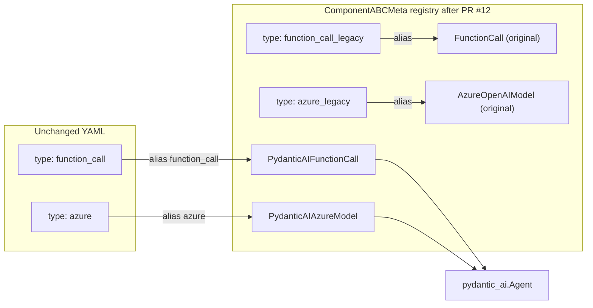
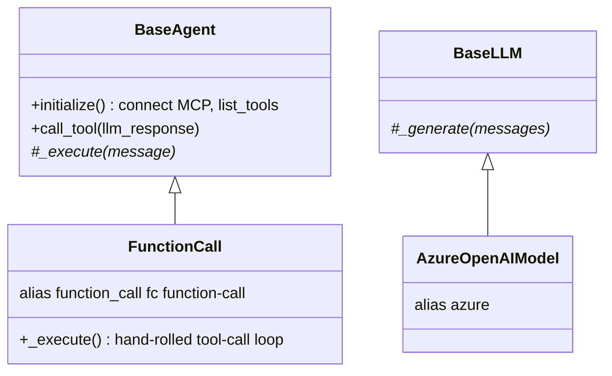
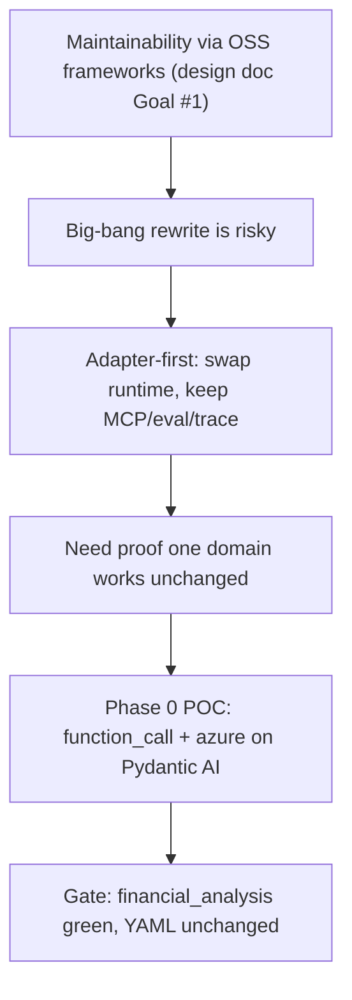

# PR #12 — Phase 0: Pydantic AI POC (Adapter-First)

> **Branch:** `feat/3-pydantic-ai-langchain-migration` → `complete-refactor`
> **Merged:** 2026-06-16 (into the `complete-refactor` integration branch, **not** `main`)
> **Closes:** Issue #6 — Part of umbrella PRD #3
> **Size:** +978 / −338, 26 files
> **Source commit:** `8d501dc` (merge `22ec443`)
> **Design context:** `docs/design/langchain-pydantic-ai-migration.md`, `docs/design/prd-langchain-pydantic-ai-migration.md`

---

## Executive Summary

* **Purpose:** Prove that MCP-Universe's custom agent/LLM runtime can be replaced by **Pydantic AI** without changing benchmark YAML, evaluators, tracing, or the MCP client layer — using an **adapter-first** strategy.
* **Scope (Phase 0):** One LLM provider (`azure`) and one agent (`function_call`) re-implemented on Pydantic AI, registered under the *canonical* aliases while the original classes are demoted to `*_legacy` aliases. Plus an MCP→Pydantic AI tool adapter, a tracing shim, output normalization, and a POC test suite (`tests/poc/`).
* **High-level impact:** Establishes the **registry-swap migration pattern** that the entire refactor branch relies on. Existing YAML keeps working because `type: azure` / `type: function_call` now resolve to Pydantic AI classes transparently.



---

## Problem Statement

Per the design doc (`docs/design/langchain-pydantic-ai-migration.md` §Problem) and PRD:

> "MCP-Universe ships a custom agent framework (BaseLLM, BaseAgent, hand-rolled ReAct/function-call loops, ComponentABCMeta registry, YAML WorkflowBuilder). This works but: onboarding cost is high — patterns are project-specific, not industry-standard."

The original architecture (`../technical_breakdown.md` §6, §8) is powerful but bespoke:
* `BaseLLM._generate()` per-provider, error-swallowing, ~15 provider files (§20 flags duplication).
* `BaseAgent` hand-rolled loops (ReAct, function-call) in `agent/*.py`.
* Auto-registration by metaclass; managers resolve `type`/`alias`.

The team's chosen direction (decision log, design doc §"Decision log") is to adopt **Pydantic AI as the agent runtime** while keeping ~70% of the codebase (MCP layer, benchmarks, evaluators, env_pool, tracing) intact behind adapters. Phase 0's job is to **de-risk** that by proving one domain end-to-end.

**Confidence: High** — PR body, PRD, and design doc all converge.

---

## Original Architecture (Upstream / fork main)



* `FunctionCall._execute()` ran a native tool-calling loop, reading `tool_calls` off the raw OpenAI-style response (the `tools`-present return path documented in `../technical_breakdown.md` §6).
* `AzureOpenAIModel` (from PR #2) used a synchronous `AzureOpenAI` client.
* Agents talked to tools via `BaseAgent.call_tool()` → `MCPClient.execute_tool()`.

---

## Change Analysis

### The registry-swap mechanism (the key idea)

PR #12 does **not** implement the "WorkflowBuilder transparent routing" described in the design doc. Instead it swaps aliases in the `ComponentABCMeta` registry:

| Class | Old alias | New alias |
|-------|-----------|-----------|
| `FunctionCall` (legacy) | `function_call`, `fc`, `function-call` | `function_call_legacy`, `fc_legacy`, `function-call-legacy` |
| `AzureOpenAIModel` (legacy) | `azure` | `azure_legacy` |
| `PydanticAIFunctionCall` (new) | — | `function_call`, `fc`, `function-call` |
| `PydanticAIAzureModel` (new) | — | `azure` |

So any YAML using `type: function_call` / `type: azure` now resolves to the Pydantic AI implementation; the original is reachable via `*_legacy` for rollback/comparison. **Confidence: High** (verified directly in the alias diffs).

### Files added

| File | Role |
|------|------|
| `mcpuniverse/agent/pydantic_ai/function_call.py` | `PydanticAIFunctionCall(BaseAgent)` — delegates the loop to `pydantic_ai.Agent.run()` |
| `mcpuniverse/agent/pydantic_ai/mcp_tools.py` | `build_mcp_pydantic_tools()` — wraps MCP tools as Pydantic AI `Tool`s |
| `mcpuniverse/agent/pydantic_ai/response.py` | `normalize_agent_output()` — unwrap `{answer: ...}` JSON for evaluators |
| `mcpuniverse/agent/pydantic_ai/tracing.py` | trace shim: `emit_llm_trace`, `build_messages_for_trace`, `summarize_run_for_trace` |
| `mcpuniverse/agent/pydantic_ai/react.py`, `function_call_wide_research.py` | stubs/partials populated more in PR #13 |
| `mcpuniverse/llm/pydantic_ai/base.py` | `PydanticAIBaseLLM(BaseLLM)` — `build_pydantic_ai_model()` abstract; `_generate()` raises |
| `mcpuniverse/llm/pydantic_ai/azure.py` | `PydanticAIAzureModel` using `AsyncAzureOpenAI` + `OpenAIChatModel` |
| `tests/poc/*` | registry resolution, agent execute, financial benchmark integration |

### Files modified / removed

* `mcpuniverse/agent/manager.py` — explicitly imports the Pydantic AI agents so they register **before** `WorkflowBuilder` snapshots the registry (the comment notes the repo doesn't rely on `__init__.py` side effects).
* `mcpuniverse/agent/__init__.py` — **deleted** (registration moved to manager import).
* `mcpuniverse/llm/__init__.py` — exports Pydantic AI models.
* `mcpuniverse/mcp/servers/yahoo_finance/server.py` — end-date handling fix.
* `mcpuniverse/mcp/manager.py` — minor adapter support.
* `pyproject.toml` — adds `pydantic-ai` dependency.
* `tests/llm/test_azure.py`, `tests/benchmark/mcpuniverse/test_benchmark_financial_analysis.py` — **deleted**, replaced by `tests/poc/` equivalents.

### Execution flow of `PydanticAIFunctionCall`

```mermaid
sequenceDiagram
    participant Caller
    participant Agent as PydanticAIFunctionCall
    participant PA as pydantic_ai.Agent
    participant Tools as build_mcp_pydantic_tools
    participant MCP as BaseAgent.call_tool -> MCPClient
    Caller->>Agent: execute(message, output_format, tracer)
    Agent->>Agent: initialize() (BaseAgent: connect MCP, list_tools)
    Agent->>Tools: wrap agent._tools as Pydantic AI Tools
    Agent->>Agent: build_pydantic_ai_model() (AsyncAzureOpenAI)
    Agent->>PA: Agent(model, instructions, tools).run(user_prompt)
    loop pydantic-ai managed tool loop
        PA->>MCP: handler(**kwargs) -> call_tool({server,tool,arguments})
        MCP-->>PA: tool result text
    end
    PA-->>Agent: result.output
    Agent->>Agent: emit_llm_trace(...) ; normalize_agent_output(...)
    Agent-->>Caller: AgentResponse(response, trace_id)
```

Two compatibility shims are critical:
1. **`mcp_tools.py`** keeps the `server__tool` naming convention (design doc stable-contract #4) so evaluators/tasks stay valid, and routes through `BaseAgent.call_tool` — preserving permissions/gateway/env_pool.
2. **`response.py`** unwraps Pydantic AI's text output back into the bare task-JSON / answer string the deterministic evaluators expect.

---

## Why The Change Was Necessary



The need is strategic, not a bug fix: reduce onboarding cost and converge on industry-standard patterns (PRD User Stories 1,6,23,27). The POC gate is explicitly "one benchmark domain end-to-end with unchanged YAML" (design doc Phase 0). Evidence is the design doc + PRD + the `tests/poc/test_benchmark_financial_analysis.py` gate.

**Confidence: High.**

---

## Before vs After

| Aspect | Before | After (on `complete-refactor`) |
|--------|--------|-------------------------------|
| `type: function_call` resolves to | `FunctionCall` (hand-rolled loop) | `PydanticAIFunctionCall` (pydantic_ai.Agent) |
| `type: azure` resolves to | `AzureOpenAIModel` (sync) | `PydanticAIAzureModel` (`AsyncAzureOpenAI`) |
| Legacy classes | canonical aliases | `*_legacy` aliases (still importable) |
| Tool loop | Custom in `BaseAgent`/agent | Managed by Pydantic AI |
| MCP transport/permissions | `MCPClient` | `MCPClient` (unchanged, via adapter) |
| Evaluators / tracing | direct | unchanged + shims |
| Agent `_generate` on Pydantic LLMs | used | raises `NotImplementedError` (model built via `build_pydantic_ai_model()`) |

---

## Architectural Impact

**Advantages**
* **Proves the adapter thesis.** ~70% of the stack (MCP, evaluators, benchmark runner, tracing) is untouched; only runtime + LLM factory change.
* **Reversible.** `*_legacy` aliases mean any benchmark can A/B the old vs new agent by changing one YAML string.
* **Async-native LLM.** Pydantic AI uses `AsyncAzureOpenAI`, aligning with the framework's async core (`anyio`/`asyncio`).

**Tradeoffs / Risks**
* **Divergence from the design doc's stated mechanism.** Design doc said "WorkflowBuilder transparent routing"; implementation uses **registry alias swapping**. Simpler, but it means the *meaning* of `type: azure` silently changed — operators reading YAML can't tell they're on Pydantic AI. Documentation debt. **Confidence: High** (diff-verified).
* **Registration ordering fragility.** Correctness now depends on `agent/manager.py` importing the Pydantic AI agents before `WorkflowBuilder` snapshots the registry; deleting `agent/__init__.py` removed the previous side-effect registration. A future import-order change could silently un-register agents. `../technical_breakdown.md` §20 already flagged registry import side-effects as a hazard.
* **Tracing is a *shim*, not parity.** `summarize_run_for_trace` reconstructs a single LLM trace record from a Pydantic AI run; the fine-grained per-turn/per-tool trace records the legacy loop emitted are lost. This can affect `BenchmarkReport`'s `llm_call_count` and MCP+ tracer analysis (`../MCP_PLUS.md` §7). **Risk: medium** for trace-dependent tooling.
* **`expected_info` / MCP+ interplay untested here** — MCP+ relies on injecting `expected_info` into tool schemas (`../MCP_PLUS.md` §5.1); the new adapter builds tools from `agent._tools` directly. MCP+ integration is deferred to PR #14.
* **Test deletions.** Removing `tests/llm/test_azure.py` and the legacy financial benchmark test (replaced by `tests/poc/`) reduces coverage of the still-present `*_legacy` classes.
* **Flaky gate.** PR body admits the integration test "may be intermittently flaky (live LLM)".

**Future maintenance**
* Sets the template every later phase follows. Any provider/agent not yet migrated must coexist with the swap; mixing a legacy LLM with a Pydantic AI agent raises `TypeError` (the agent constructor asserts `isinstance(llm, PydanticAIBaseLLM)`), so partial migrations require matched LLM+agent pairs.

---

## Validation

**Did it solve the problem?** For Phase 0 scope, yes — `function_call` + `azure` run `financial_analysis` end-to-end with unchanged YAML through Pydantic AI, validated by `tests/poc/`.

**Rating: Reasonably justified.**

Reasoning:
* The strategic motivation is well-documented and the POC gate is concrete and met.
* Deductions from "strongly": (a) the implementation mechanism (registry alias swap) **diverges from the documented design** (WorkflowBuilder routing) without updating that design — a real archaeology trap; (b) tracing is a lossy shim, risking report/MCP+ analysis fidelity that the design doc lists as a *high-priority* stable contract; (c) net coverage of legacy paths dropped; (d) self-admitted flaky gate. These are acceptable for a POC but are genuine architectural risks carried forward.
