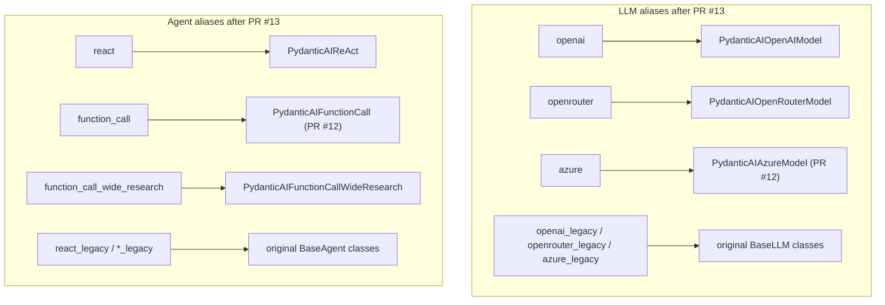
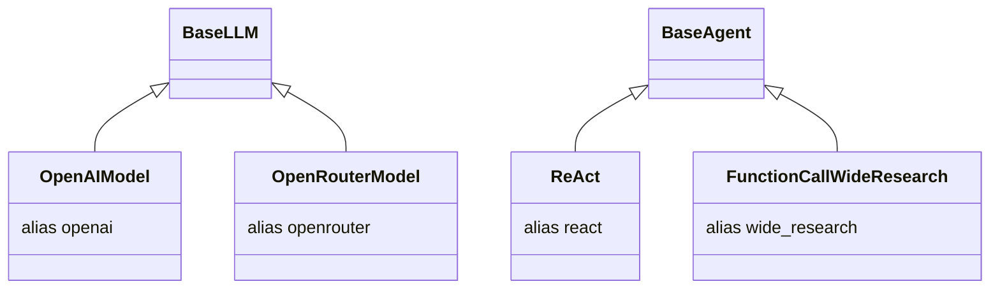
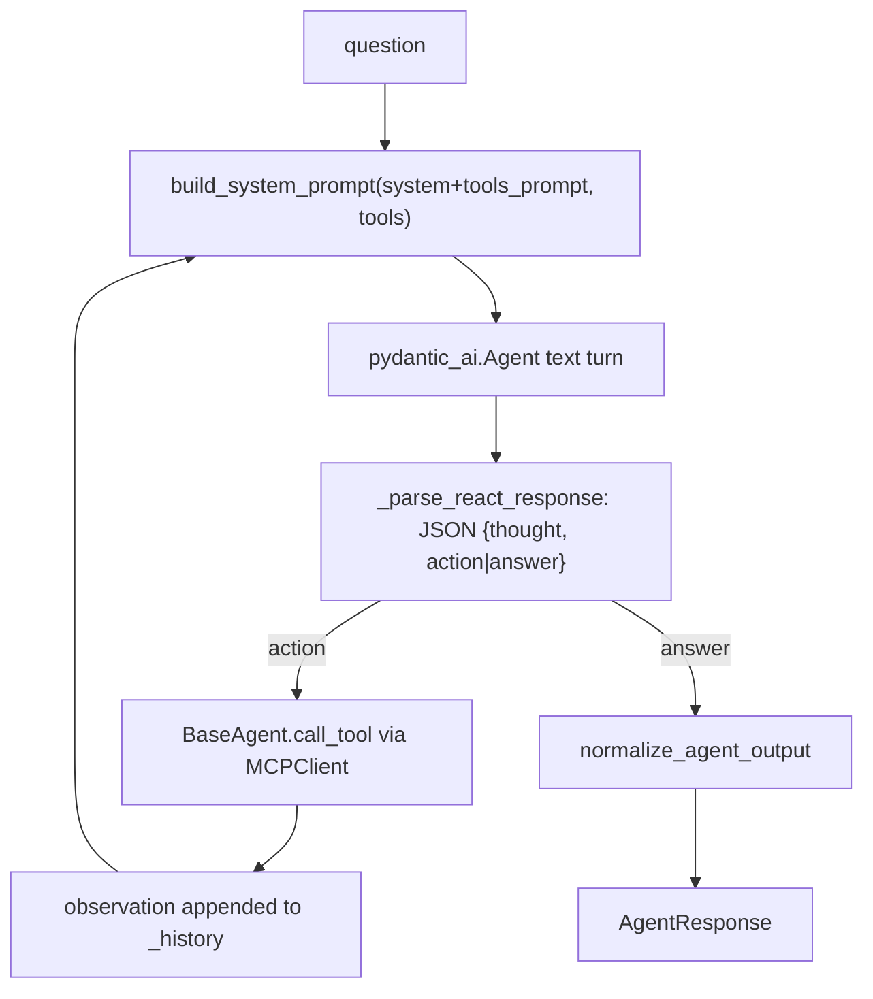
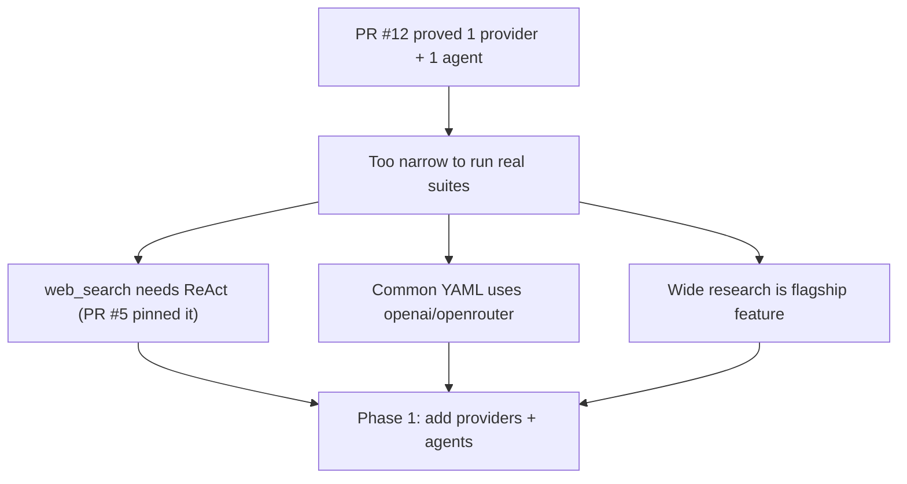

# PR #13 — Phase 1: Pydantic AI Providers (OpenAI, OpenRouter) and Agents (ReAct, Wide Research)

> **Branch:** `feat/7-phase-1-pydantic-ai-providers-agents` → `complete-refactor`
> **Merged:** 2026-06-17 (into `complete-refactor`, **not** `main`)
> **Closes:** Issue #7 — builds on PR #12
> **Size:** +1173 / −175, 25 files
> **Source commits:** `dd6cdfc`, `d01d447` (merge `2d86329`)

---

## Executive Summary

* **Purpose:** Broaden the Phase 0 POC into a usable migration: add **OpenAI** and **OpenRouter** providers and the **ReAct** and **wide research** agents on Pydantic AI, all behind the existing canonical aliases.
* **Scope:** Extends the registry-swap pattern from PR #12 to more components; extracts shared output normalization; hardens registration ordering; adds POC tests for each new provider/agent.
* **High-level impact:** Makes the `complete-refactor` branch capable of running the common benchmark agent types (`react`, `function_call`, `function_call_wide_research`) across the common cloud providers (`openai`, `openrouter`, `azure`) on Pydantic AI — the heart of design-doc Phase 1.

---

## Problem Statement

PR #12 proved the pattern for one provider + one agent. But the benchmark suite (`../technical_breakdown.md` §11, `../llm_judge.md` §4) depends on more:

* **ReAct** is essential — `web_search.yaml` was pinned to ReAct + Azure in PR #5, and the design doc (Phase 1) calls ReAct "critical for local LLMs without reliable native tool calling".
* **Wide research** is the flagship parallel tool-calling agent (`../technical_breakdown.md` §8, `function_call_wide.py`).
* **OpenAI** and **OpenRouter** are the most common providers in shipped YAML.

Without these, the refactor branch could only run a sliver of the suite. Phase 1's job is to make the migration broadly exercisable while still touching zero external YAML.

**Confidence: High** — PR body + design-doc Phase 1 checklist.

---

## Original Architecture (fork main / pre-refactor)

* `ReAct` (`agent/react.py`) ran the classic thought→action→observation loop, parsing a JSON `{thought, action|answer}` contract from raw text (no native tool calling) — the loop drawn in `../technical_breakdown.md` §8.
* `OpenRouterModel` is an OpenAI-compatible provider (different base URL + a provider/`reasoning` field).
* Wide research (`function_call_wide.py`) fanned out parallel tool calls.

---

## Change Analysis

### Providers added

| File | Class | Backend |
|------|-------|---------|
| `mcpuniverse/llm/pydantic_ai/openai.py` | `PydanticAIOpenAIModel` (alias `openai`) | `AsyncOpenAI` → `OpenAIChatModel` via `OpenAIProvider(openai_client=...)` |
| `mcpuniverse/llm/pydantic_ai/openrouter.py` | `PydanticAIOpenRouterModel` (alias `openrouter`) | OpenAI-compatible base URL |

The original `OpenAIModel`/`OpenRouterModel` are demoted to `openai_legacy`/`openrouter_legacy` (same swap pattern as PR #12; verified in diff).

### Agents added / completed

| File | Class | Notes |
|------|-------|-------|
| `mcpuniverse/agent/pydantic_ai/react.py` | `PydanticAIReAct` (alias `react`) | Keeps the **legacy JSON thought/action/answer contract**; uses Pydantic AI only for the LLM *turn*, not native tool calling. Manual history accumulation (`_history`), `_parse_react_response`, `tools_prompt` rendering preserved. |
| `mcpuniverse/agent/pydantic_ai/function_call_wide_research.py` | `PydanticAIFunctionCallWideResearch` | Minimal adapter; full parallel scheduler port explicitly deferred (PR body "Out of scope"). |

`ReAct`/`FunctionCallWideResearch` legacy classes demoted to `react_legacy` / `*_legacy`.

### Shared infrastructure

* `mcpuniverse/agent/pydantic_ai/response.py` — `normalize_agent_output` now shared by ReAct and function-call agents (extracted in PR #13 per body).
* `mcpuniverse/agent/manager.py` — imports all Pydantic AI agents so registration precedes `WorkflowBuilder` registry snapshot (continues the PR #12 ordering fix).
* `tests/poc/` — registry tests for `openai`, `openrouter`, `react`, `wide_research`; smoke workflows; benchmark smoke retries once on live-LLM flakiness.
* `tests/workflow/test_workflow_builder_azure.py` → renamed to `tests/poc/test_workflow_azure_registry.py` (R057).

### ReAct design subtlety

Notably, `PydanticAIReAct` does **not** hand tools to Pydantic AI as native `Tool`s (unlike `PydanticAIFunctionCall`). It keeps the legacy text-protocol loop and only swaps the LLM call backend. This preserves behavior for models without reliable native tool calling — exactly the design-doc rationale for migrating ReAct.

---

## Why The Change Was Necessary

The motivation is completing enough of the migration surface to be useful while honoring the "no YAML changes" contract. Evidence: design-doc Phase 1 checklist (react, wide research, all providers via factory) and PR body scope/out-of-scope lists.

**Confidence: High.**

---

## Before vs After

| Component | Before (resolves to) | After (resolves to) |
|-----------|----------------------|---------------------|
| `type: openai` | `OpenAIModel` | `PydanticAIOpenAIModel` |
| `type: openrouter` | `OpenRouterModel` | `PydanticAIOpenRouterModel` |
| `type: react` | `ReAct` | `PydanticAIReAct` |
| `type: function_call_wide_research` | `FunctionCallWideResearch` | `PydanticAIFunctionCallWideResearch` (minimal) |
| Legacy access | n/a | `*_legacy` aliases |
| Output for evaluators | direct | `normalize_agent_output` (shared) |

---

## Architectural Impact

**Advantages**
* **Broad coverage** of the common provider × agent matrix on the new runtime, still YAML-transparent.
* **ReAct fidelity:** keeping the legacy text protocol (rather than forcing native tool calling) protects local/weak-tool-calling models — a deliberate, well-reasoned choice.
* **Consolidation:** OpenAI/OpenRouter/Azure now share `OpenAIChatModel` + `OpenAIProvider`, directly attacking the "15 near-duplicate provider files" debt (`../technical_breakdown.md` §20).

**Tradeoffs / Risks**
* **Wide research is only a *minimal* adapter.** The flagship parallel scheduler is **not** ported (PR body out-of-scope). Benchmarks relying on true wide/parallel behavior (deep research `agent_wide_research_*.yaml`, `../llm_judge.md` §4.2) may behave differently or degrade silently. **Risk: high** for those suites; **Confidence: High** this is incomplete (explicit in PR body).
* **Two ReAct flavors of "Pydantic AI".** `PydanticAIFunctionCall` uses native Pydantic AI tools; `PydanticAIReAct` does not. The "migration" is therefore uneven — ReAct is mostly a backend swap. Reader must not assume "Pydantic AI agent" means uniform behavior.
* **Same registration-order fragility** as PR #12, now spanning more classes.
* **Tracing shim still lossy** (inherited from PR #12) — now applied to more agents.
* **`function_call_wide_claude` and Harmony not migrated** — legacy-only; mixing them with new Pydantic AI LLM aliases will raise `TypeError` (agent asserts `PydanticAIBaseLLM`). Operators must pair carefully.
* **Branch isolation.** All of this lives on `complete-refactor`, never merged to `main`. `main` still runs the legacy stack + Azure. This is the single largest architecture/branch divergence in the fork (see `../architecture_delta.md`).

**Future maintenance**
* Phase 2 (PR #14) builds the unified context layer on top of `PydanticAIFunctionCall`. The un-ported wide-research scheduler and the legacy-only agents remain the biggest cleanup items before this branch could replace `main`.

---

## Validation

**Did it solve the problem?** Largely yes for the declared Phase 1 scope: providers and ReAct are real and tested; wide research is intentionally minimal. PR reports 16 passing POC tests (excluding live financial) plus live Azure benchmark.

**Rating: Reasonably justified.**

Reasoning:
* Clear strategic need, concrete scope, tests per new component, and a sound ReAct design decision.
* Held back from "strongly" by: (a) **wide research not actually migrated** beyond a stub while occupying the canonical `function_call_wide_research` alias — a behavioral risk for deep-research suites; (b) inherited lossy tracing + registration-order fragility; (c) the work remains on an unmerged branch, so its real-world validation against `main` is unproven.
