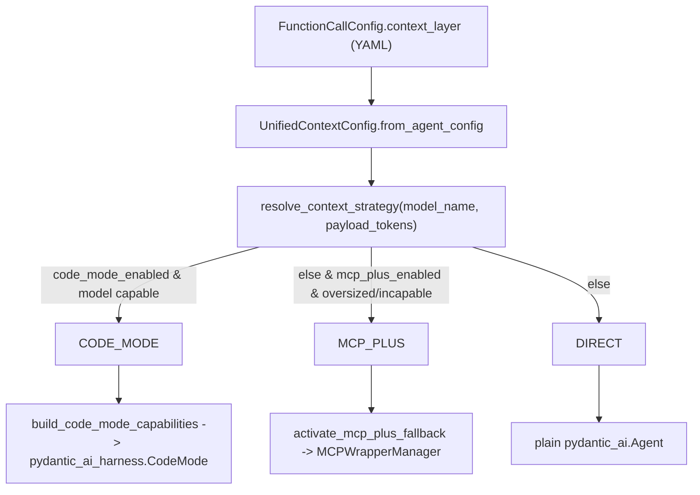
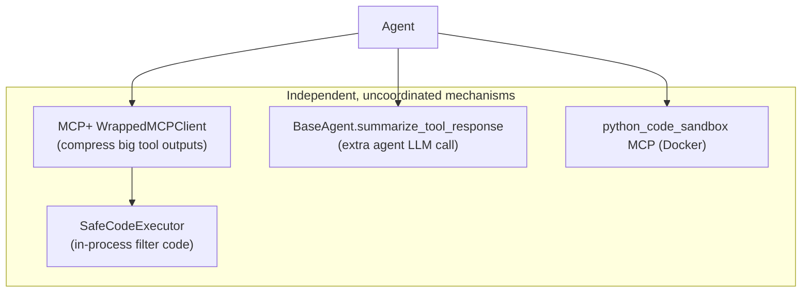
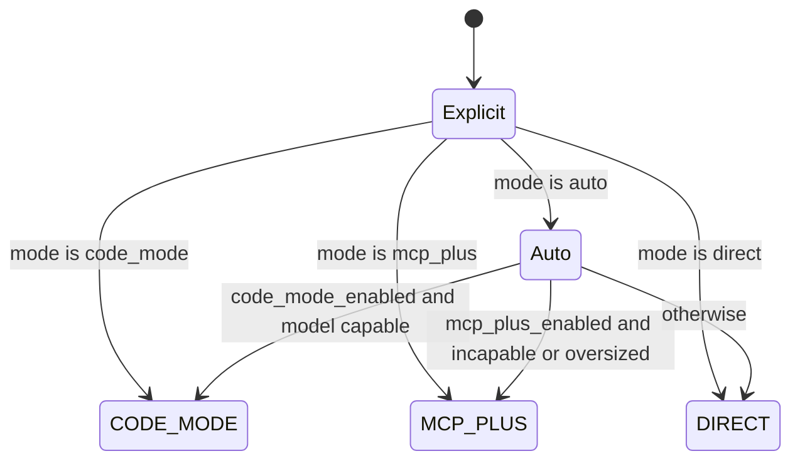
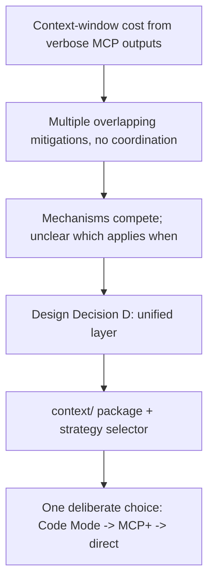

# PR #14 — Phase 2: Code Mode + Unified Context Layer

> **Branch:** `feat/8-phase-2-code-mode-context-layer` → `complete-refactor`
> **Status:** **OPEN / not merged** (as of audit). Analyzed here because it is an approved long-lived feature branch containing architecturally significant changes (Phase 4 mandate).
> **Closes:** Issue #8 — builds on PR #12 + #13
> **Size:** +567 / −18, 13 files
> **Source commit:** `cdfa477`

---

## Executive Summary

* **Purpose:** Introduce a **unified context-reduction layer** that chooses between **Code Mode** (programmatic tool calling via a sandboxed harness) and **MCP+** (tool-output compression) — fulfilling design-doc Decision D ("CodeMode + MCP+ fallback").
* **Scope:** New `mcpuniverse/context/` package (strategy selection + MCP+ activation), Code Mode wiring into `PydanticAIFunctionCall`, an optional `pydantic-ai-harness[code-mode]` extra, and context-layer tests.
* **High-level impact:** Replaces the *ad hoc* set of overlapping context mechanisms (MCP+, `summarize_tool_response`, SafeCodeExecutor) with a single deliberate strategy selector. **Still on an unmerged branch and gated behind an optional dependency.**

---

## Problem Statement

The design doc (§"MCP+ vs CodeMode (CE)") and PRD frame the issue precisely:

> "The framework also faces growing context-window pressure from verbose MCP tool outputs. Multiple overlapping mitigation mechanisms exist today (MCP+, summarize_tool_response, in-process SafeCodeExecutor, python-code-sandbox Docker MCP), and there is no unified strategy."

From `../MCP_PLUS.md` §10, MCP+ (compress **responses**) and Code Mode (shrink **tool surface** + scripted round-trips) are *orthogonal*. The team's decision (design-doc Decision 4): compose them — Code Mode primary, MCP+ fallback — instead of letting them compete.

**Confidence: High** — design doc, PRD, and issue #8.

---

## Original Architecture (Context Reduction Before PR #14)

Per `../MCP_PLUS.md`: MCP+ is a client-side shim (`MCPWrapperManager`/`WrappedMCPClient`) that runs a secondary LLM (`PostProcessAgent`) when a tool output exceeds `token_threshold` and the agent supplied `expected_info`. `summarize_tool_response` (`../llm_judge.md` §9.1) is a *separate* per-tool summarization. There was **no selector** deciding which to use.

---

## Change Analysis

### New package `mcpuniverse/context/`

| File | Contents |
|------|----------|
| `layer.py` | `ContextStrategy` enum (`code_mode`/`mcp_plus`/`direct`); `UnifiedContextConfig` (YAML `context_layer` block); `model_supports_code_mode()` (prefix allow-list: gpt-4/5, o1/o3, claude-3/sonnet/opus/haiku); `select_context_strategy()` + `resolve_context_strategy()` decision logic |
| `mcp_plus.py` | `activate_mcp_plus_fallback()` — wraps an `MCPManager` as `MCPWrapperManager(WrapperConfig(enabled=True, token_threshold))`, copies `_raw_configs`, calls `set_llm()` |

### Strategy decision logic

### Agent wiring (`PydanticAIFunctionCall` diff)

* Constructor parses `context_layer` from YAML into `UnifiedContextConfig`.
* New `initialize()` override: if strategy resolves to `MCP_PLUS`, swap `self._mcp_manager` for the MCP+ wrapper **before** connecting.
* `_execute()`: build Code Mode capabilities and pass `capabilities=...` to `pydantic_ai.Agent`.
* `code_mode.py`: `build_code_mode_capabilities()` lazily imports `pydantic_ai_harness.CodeMode`; raises a clear install hint if the optional extra is missing.

### Dependency / config

* `pyproject.toml` — optional extra `code-mode` → `pydantic-ai-harness[code-mode]` (PR body notes it's optional "due to dependency pin conflicts").
* Tests: `test_context_layer.py`, `test_agent_function_call_code_mode.py`, `test_context_mcp_plus_fallback.py`.

---

## Why The Change Was Necessary

Evidence: PRD User Stories 11–14 ("unified context reduction layer", "CodeMode for supported models", "MCP+ as fallback"), design-doc Phase 2 checklist, issue #8.

**Confidence: High** for motivation. **Confidence: Medium** that the implementation fully delivers it (Code Mode path is gated behind an optional, pin-conflicted dependency and not run in CI per the PR's own test plan).

---

## Before vs After

| Aspect | Before | After (on branch) |
|--------|--------|-------------------|
| Choosing a context strategy | None (mechanisms independent) | `resolve_context_strategy()` central selector |
| Code Mode | Absent | `pydantic_ai_harness.CodeMode` capability (optional extra) |
| MCP+ activation | Manual (YAML `kind: wrapper` / CLI) | Auto via `activate_mcp_plus_fallback()` at `initialize()` |
| Config surface | MCP+ `WrapperConfig` only | `context_layer` YAML block on `FunctionCallConfig` |
| Coverage | n/a | `PydanticAIFunctionCall` only (not ReAct/wide/legacy) |

---

## Architectural Impact

**Advantages**
* **Single decision point** replaces ad hoc competition — exactly the design intent.
* **MCP+ reused, not rewritten** — `activate_mcp_plus_fallback` builds on existing `MCPWrapperManager`/`WrapperConfig` (`../MCP_PLUS.md` §5.1), honoring the "keep MCP+, refactor onto new stack" decision.
* **Graceful optionality** — missing harness raises an actionable error, not a crash on import.

**Tradeoffs / Risks**
* **OPEN / unmerged.** Not on `main` *or* validated against the merged refactor branch's end state. Lowest maturity of all analyzed PRs.
* **Code Mode is effectively unproven.** PR test plan marks the live Code Mode smoke as optional and not required for CI due to "dependency pin conflicts"; the capability hinges on a third-party `pydantic-ai-harness` extra. **Risk: high** that Code Mode is aspirational rather than production-ready.
* **Capability detection is a hardcoded prefix allow-list** (`_CODE_MODE_CAPABLE_PREFIXES`). It will misclassify Azure *deployment names* (which are operator-chosen and may not start with `gpt-`/`claude-`), silently downgrading to MCP+/direct even on capable models. Given the fork's whole point is Azure deployments, this is a real correctness gap. **Confidence: High** (logic is in `model_supports_code_mode`).
* **Private-attribute coupling.** `activate_mcp_plus_fallback` reaches into `_context` and `_raw_configs` — brittle against `MCPManager` internals (`../technical_breakdown.md` §7).
* **Narrow coverage.** Only `PydanticAIFunctionCall` is wired; ReAct, wide research, and all legacy agents have no unified context layer.
* **`summarize_tool_response` deprecation** (design-doc Phase 2 goal) is **not** done — the overlap the PR set out to eliminate partly remains.

**Future maintenance**
* The prefix allow-list and Azure-deployment naming mismatch must be resolved before Code Mode is trustworthy on the fork's primary provider.
* Until merged and de-gated, this is design-validated but not behavior-validated.

---

## Validation

**Did it solve the problem?** Partially / provisionally. The *selector* and *MCP+ fallback* are real and tested; the *Code Mode* half is gated behind an optional, untested-in-CI dependency and a capability heuristic that misfires on Azure deployment names.

**Rating: Weakly justified (as a shipped capability) / Reasonably justified (as a design spike).**

Reasoning:
* The motivation and the strategy abstraction are sound and well-documented.
* But the headline feature (Code Mode) is not demonstrably working in CI, depends on a pin-conflicted external package, and its capability gate is incompatible with the fork's own Azure-deployment naming. Combined with the branch being unmerged, the *delivered* value is closer to a validated design + working MCP+ auto-fallback than a proven Code Mode integration. The honest rating depends on whether you score intent (reasonable) or shipped behavior (weak).
