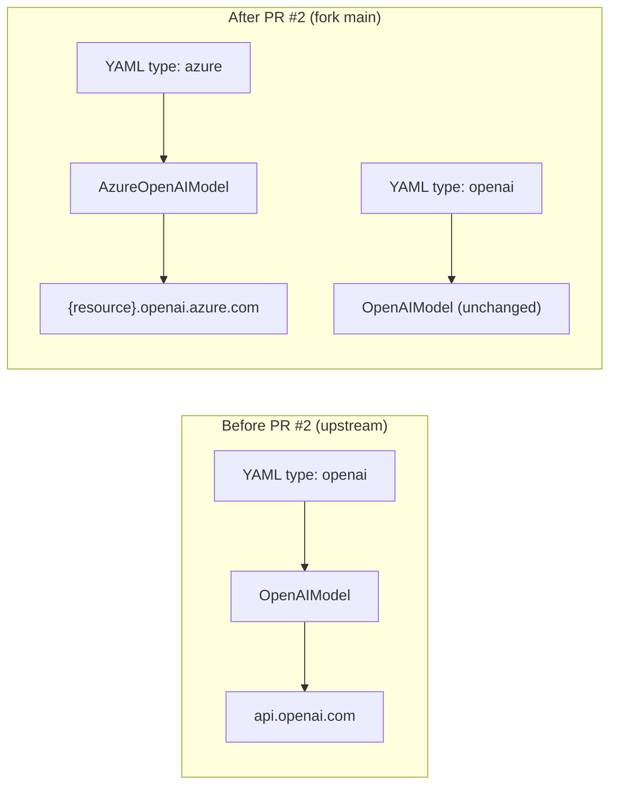
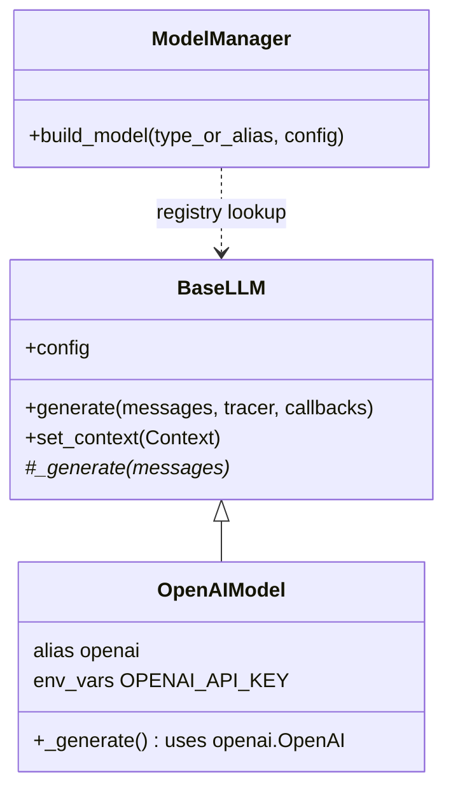
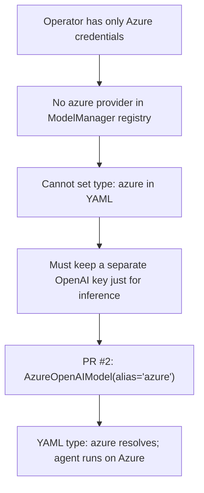
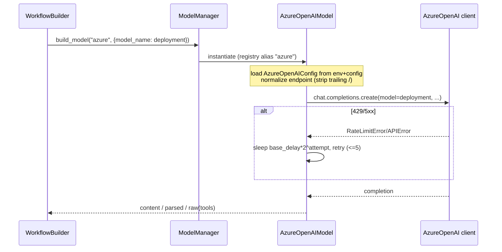

# PR #2 — Add Azure OpenAI LLM Provider

> **Branch:** `feat/azure-openai-llm-provider` → `main`
> **Merged:** 2026-06-15 (merge commit `fcc9718`)
> **Closes:** Issue #1
> **Size:** +488 / −9, 12 files
> **Source commits:** `2b5d982` (provider), `0cb1659` (smoke test + error handling)

---

## Executive Summary

* **Purpose:** Add a first-class **Azure OpenAI** LLM provider (`type: azure`) to the fork so that benchmark *agents* can run against an Azure deployment instead of public OpenAI.
* **Scope:** A new `AzureOpenAIModel` provider class, its registration, MCP+ proxy/CLI plumbing so wrapped servers can carry Azure credentials, docs (`README`, `.env.example`), and unit/smoke tests.
* **High-level impact:** Establishes Azure as an *explicit, opt-in* provider that reuses the OpenAI implementation surface. It is the foundational first step of the "Azure migration" theme; it deliberately covers the **agent LLM path only**, leaving the **evaluator judge path** on OpenAI (fixed later in PR #5).

---

## Problem Statement

The upstream MCP-Universe LLM layer (`../technical_breakdown.md` §6) ships ~15 provider subclasses of `BaseLLM` (`OpenAIModel`, `ClaudeModel`, gateways, etc.) registered via the `ComponentABCMeta` metaclass and resolved by `ModelManager.build_model(type|alias, config)`. **None of them targeted Azure OpenAI.**

Azure OpenAI is API-compatible with the OpenAI SDK but differs in three ways that make `OpenAIModel` unusable as-is:

1. **Different client class** — `AzureOpenAI` instead of `OpenAI`, requiring `azure_endpoint` + `api_version` instead of `base_url`.
2. **Deployment names, not model IDs** — the `model` argument is an Azure *deployment* name chosen by the operator, not a canonical model ID like `gpt-4.1`.
3. **Different env vars** — `AZURE_API_KEY` / `AZURE_API_BASE` / `AZURE_API_VERSION`.

The fork's operators (per `.scratch/azure-migration-complete/prd-issue.md`) wanted to run the benchmark suite with a **single Azure credential story**. Step one of that goal is an agent-side Azure provider.

**Confidence: High.** The PR body explicitly states "Add explicit opt-in `azure` LLM provider", the new file documents the three env vars, and `model_name` is documented as "Azure deployment name".

---

## Original Architecture (Upstream)

Key upstream behaviors relevant here:

* `OpenAIConfig` (dataclass) holds `model_name`, `temperature`, `top_p`, penalties, `max_completion_tokens`, `seed`, `timeout`, `parallel_tool_calls`, `base_url`, `api_key`, and a `reasoning_effort` path for reasoning models.
* `OpenAIModel._generate()` builds an `openai.OpenAI` client, handles the `response_format` (structured parse) and `tools` (returns the raw response) branches, and swallows errors to `None` (`../technical_breakdown.md` §6 "Errors are swallowed to `None`").
* Registration is import-side-effect driven: a class is only registered when its module is imported in `llm/__init__.py`.

---

## Change Analysis

### Files changed

| File | Type | What |
|------|------|------|
| `mcpuniverse/llm/azure.py` | **Added** | `AzureOpenAIConfig`, `AzureOpenAIModel`, endpoint normalization, retry logic |
| `mcpuniverse/llm/__init__.py` | Modified | Import + export `AzureOpenAIModel` so the metaclass registers it |
| `mcpuniverse/extensions/mcpplus/tools/wrap_mcp_config.py` | Modified | Add `azure` branch to gateway config fields + env-var passthrough |
| `mcpuniverse/extensions/mcpplus/tools/proxy_server.py` | Modified | Generalize `$VAR` expansion to also cover `azure_endpoint` + `api_version` |
| `.env.example` | Modified | Document `AZURE_API_KEY` / `AZURE_API_BASE` / `AZURE_API_VERSION` |
| `.gitignore` | Modified | Ignore `.agents/skills`, `skills-lock.json` (agent tooling noise) |
| `README.md` | Modified | Azure setup section |
| `scripts/smoke_azure.py` | **Added** | Live smoke test for the provider |
| `tests/llm/test_azure.py` | **Added** | Registration, env validation, deployment-name preservation |
| `tests/workflow/test_workflow_builder_azure.py` | **Added** | `type: azure` resolves through `WorkflowBuilder` |
| `tests/extensions/mcpplus/tools/test_wrap_mcp_config_azure.py` | **Added** | MCP+ azure config expansion |
| `tests/extensions/mcpplus/tools/test_proxy_server.py` | Modified | Azure env-var expansion case |

### Classes / functions

`AzureOpenAIConfig(OpenAIConfig)` — subclasses the OpenAI config so all generation params are inherited; adds `api_key` (`AZURE_API_KEY`), `azure_endpoint` (`AZURE_API_BASE`), `api_version` (`AZURE_API_VERSION`, default `2024-12-01-preview`).

`AzureOpenAIModel(OpenAIModel)` — `alias = "azure"`, `env_vars = ["AZURE_API_KEY", "AZURE_API_BASE"]`. It:

* **Re-implements `_generate()`** to build an `AzureOpenAI` client per call (with explicit retry loop and exponential backoff over a retryable status-code set `{429, 500, 502, 503, 504}`).
* Preserves the upstream `_generate` contract — three return shapes (`content` / parsed pydantic / raw `chat` when `tools` present), error→`None`.
* **Never rewrites `model_name`** (the deployment name) — explicit comment guards against an Azure-specific footgun.
* Calls `super(OpenAIModel, self).__init__()` — i.e. it bypasses `OpenAIModel.__init__` and reuses `BaseLLM.__init__`, then loads `AzureOpenAIConfig`.
* Overrides `set_context()` to refresh credentials/endpoint from the runtime `Context.env` (important for the web service / templated configs where env is injected late).

### Config / dependencies

* No new third-party dependency — `AzureOpenAI` ships inside the already-present `openai` package.
* New env vars only.

---

## Why The Change Was Necessary

Evidence the motivation is **Azure enablement (cost/compliance/credential consolidation)**, not a generic refactor:

* PR title/body and `Closes #1`.
* The dedicated `.env.example` block, `scripts/smoke_azure.py`, and a README section.
* The MCP+ changes specifically thread Azure credentials through the *remote/proxy* path — meaning the intent is to run real Azure-backed servers, not just local tests.

**Confidence: High.**

---

## Before vs After

| Aspect | Before (upstream) | After (PR #2) |
|--------|-------------------|----------------|
| Azure agent runs | Impossible (no provider) | `type: azure` + deployment name |
| Client | `openai.OpenAI` only | `AzureOpenAI` for azure alias |
| Retry policy | Inherited OpenAI behavior (swallow→None) | Explicit bounded retry w/ exponential backoff on retryable status codes, then `None` |
| MCP+ proxy env expansion | `api_key`, `base_url` only | + `azure_endpoint`, `api_version` |
| Evaluator (judge) LLM | OpenAI | **Still OpenAI** (out of scope here) |

---

## Architectural Impact

**Advantages**

* **Minimal, idiomatic extension.** Follows the documented extension point exactly (`../technical_breakdown.md` §18 "New LLM provider: subclass BaseLLM, set alias + env_vars, import in `llm/__init__.py`"). No core edits.
* **Reuse via subclassing `OpenAIConfig`/`OpenAIModel`** keeps generation-param parity with the OpenAI provider for free.
* **Better resiliency than the base path** — explicit, classified retry instead of pure swallow-to-`None`.

**Tradeoffs / Risks**

* **Per-call client construction.** `AzureOpenAI(...)` is instantiated inside `_generate()` on every attempt, not cached. Negligible for benchmarks, but slightly wasteful and divergent from how some providers cache clients.
* **Config defaults bound at import time.** `AzureOpenAIConfig` reads `os.getenv(...)` as dataclass field defaults; `load_dotenv()` runs at import. `set_context()` mitigates this for runtime env injection, but a process that mutates `os.environ` after import without a `Context` would see stale defaults.
* **Partial migration creates a silent split-brain.** Agents now run on Azure while evaluator judges still call OpenAI directly — an operator with Azure-only credentials sees agents succeed but web-search grading fail. This is the exact gap PR #5 was created to close (documented in `.scratch/azure-migration-complete/prd-issue.md` §"Current state summary").
* **Reasoning-effort parity not handled** for Azure gpt-5-class deployments (comment defers it to caller kwargs). Later flagged in the PR #5 PRD.

**Future maintenance implications**

* Azure now joins the ~15 provider files the breakdown already calls out as duplicative (§20). It strengthens the case for an OpenAI-compatible shared base — which the later Pydantic AI migration (PR #12/#13) ultimately acts on.

---

## Validation

**Did it solve the problem?** Yes for its declared scope (agent path). `type: azure` resolves through the registry and `WorkflowBuilder` (covered by `tests/workflow/test_workflow_builder_azure.py` and `tests/llm/test_azure.py`), and MCP+ proxying carries Azure creds.

**Rating: Strongly justified.**

Reasoning:
* Clear, evidenced need (`Closes #1`, operator credential consolidation).
* Implementation matches the framework's own documented extension pattern.
* Tests cover registration, env validation, deployment-name preservation, workflow resolution, and MCP+ expansion.
* The one substantive incompleteness (evaluator path) is *explicitly acknowledged* and scoped out, then addressed in PR #5 — i.e. a deliberate phasing decision, not an oversight.
