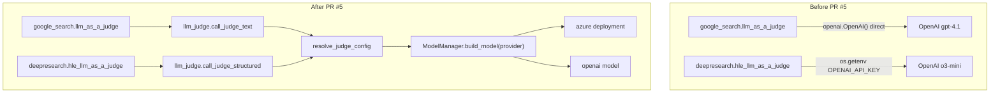
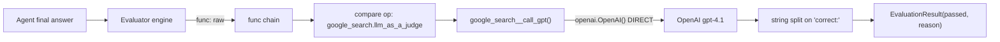
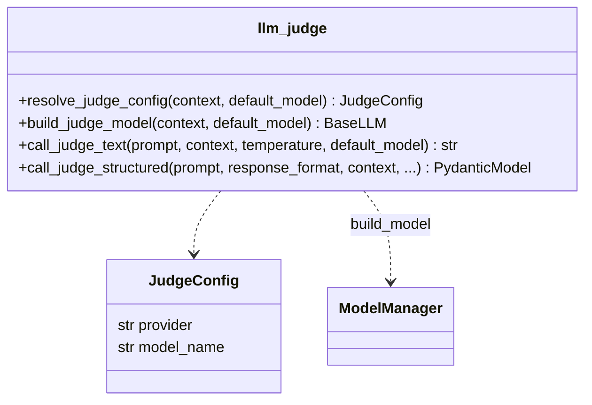
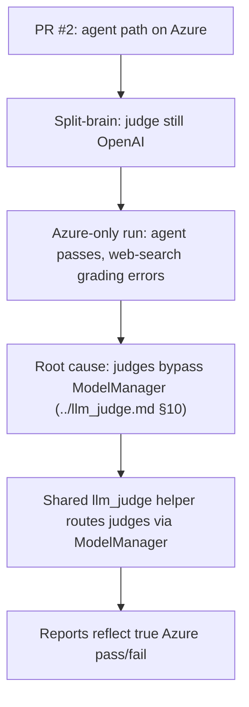
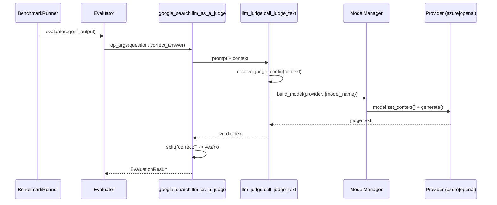

# PR #5 — Azure Evaluator Judge (Complete the Azure Migration)

> **Branch:** `feat/azure-evaluator-judge` → `main`
> **Merged:** 2026-06-16 (merge commit `73a65b8`)
> **Size:** +983 / −77, 14 files
> **Source commits:** `f6b88ed`, `6409a1c`, `5a92861`, `3a12672`, `65c37e8`
> **Design context:** `.scratch/azure-migration-complete/prd-issue.md`

---

## Executive Summary

* **Purpose:** Close the second half of the Azure migration — make the **LLM-as-judge evaluator path** route through the same provider stack as agents, so an Azure-only operator gets *honest* benchmark grades instead of agent-success-with-silent-judge-failure.
* **Scope:** A new shared judge helper (`evaluator/llm_judge.py`), refactor of the two existing LLM judges (`google_search`, `deepresearch`) to use it, batch migration of benchmark YAMLs to `type: azure`, operator run scripts, smoke tests, and the migration design docs (`docs/design/*`).
* **High-level impact:** Eliminates the "split-brain" left by PR #2. Judge calls now flow through `ModelManager` with provider auto-detection (Azure when `AZURE_*` is set), restoring report fidelity for Azure-only runs.

---

## Problem Statement

`../llm_judge.md` documents the exact defect this PR targets:

> "**Separate from agent LLM:** The judge uses its **own** direct `openai.OpenAI` client — it does **not** go through `mcpuniverse.llm.ModelManager` or the agent's Azure/OpenRouter config. Running financial_analysis with Azure for the agent does not automatically route judge calls to Azure." (`../llm_judge.md` §10)

There are exactly **two** evaluator-level judges (`../llm_judge.md` §3):

| Judge | File | Old client | Old model |
|-------|------|-----------|-----------|
| `google_search.llm_as_a_judge` | `evaluator/google_search/functions.py` | `openai.OpenAI(api_key=context.get_env("OPENAI_API_KEY"))` | `gpt-4.1` (hardcoded) |
| `deepresearch.hle_llm_as_a_judge` | `evaluator/deepresearch/functions.py` | `openai.OpenAI(api_key=os.getenv("OPENAI_API_KEY"))` | `o3-mini-2025-01-31` (hardcoded) |

After PR #2, an Azure-only operator running `web_search` (50 tasks graded by `google_search.llm_as_a_judge`, `../llm_judge.md` §4.1) would have the **agent succeed on Azure** but the **judge fail for lack of `OPENAI_API_KEY`** — producing reports that understate true pass rate. The PRD calls this out directly: *"agents run successfully on Azure while reports show evaluation failures"* (`prd-issue.md` §Problem Statement).

**Confidence: High** — corroborated by `../llm_judge.md`, the PRD, and the diff itself.

---

## Original Architecture (Upstream)

Per `../llm_judge.md` §3.1–3.2:

* `google_search` parses the verdict with a fragile `response.split("correct:")[1]` then `if "yes" in judge`.
* `deepresearch` is more robust — structured Pydantic output (`HLEExtractedAnswer`) via `beta.chat.completions.parse`.
* Both used direct OpenAI clients, hardcoded model IDs, and 5 inner API retries.
* Crucially: these judge calls **bypass `ModelManager`** entirely, so the Azure adapter from PR #2 had no effect on them.

---

## Change Analysis

### New module: `mcpuniverse/evaluator/llm_judge.py` (+123)

A provider-agnostic judge facade. Key surface:

* **`resolve_judge_config()`** — provider selection precedence:
  1. `EVAL_LLM_PROVIDER` if set (explicit override → hybrid Azure-agent/OpenAI-judge possible).
  2. else **`azure`** if `AZURE_API_KEY` **and** `AZURE_API_BASE` present.
  3. else `openai`.
  Model name precedence: `EVAL_LLM_MODEL_NAME` → (azure) `AZURE_JUDGE_DEPLOYMENT` → caller default.
* **`build_judge_model()`** — builds the model via `ModelManager().build_model(provider, {...})` and calls `set_context()`, i.e. it **reuses the exact provider stack agents use**, including PR #2's `AzureOpenAIModel`.
* **`call_judge_text()` / `call_judge_structured()`** — text and structured (`response_format`) entry points with a 5-attempt retry loop, mirroring prior judge behavior.

### Refactor: `google_search/functions.py` (−13 net)

`google_search__call_gpt()` body replaced: removed `openai.OpenAI` import and the client/retry block; now delegates to `call_judge_text(prompt, context=context, temperature=temperature, default_model_name=model)`. The fragile verdict parsing (`split("correct:")`) and outer retries remain untouched.

### Refactor: `deepresearch/functions.py` (−14 net)

`deepresearch__call_gpt_hle()` body replaced: removed `import os` / `from openai import OpenAI` and the `beta.chat.completions.parse` block; now delegates to `call_judge_structured(prompt, response_format=HLEExtractedAnswer, context=context, default_model_name=model)`. Return type tightened to `HLEExtractedAnswer | None`. Note it now also threads a `Context` from kwargs (previously used raw `os.getenv`).

### Benchmark YAML migration

| File | Change |
|------|--------|
| `financial_analysis.yaml` | `type: openai`/`gpt-4.1` → `type: azure`/`gpt-5.4-mini` |
| `web_search.yaml` | `type: openrouter`+`harmony_react`+`reasoning: high` → `type: azure`/`gpt-5.4-mini` + plain `react` agent |
| `multi_server.yaml` | **Un-commented** ~24 previously-disabled tasks (weather/playwright/notion/github), normalized agent |
| `3d_design.yaml`, `dummy/benchmark_1.yaml` | provider flip to azure |

The `web_search.yaml` change is significant: it swaps **Harmony ReAct (OpenRouter)** for **plain ReAct (Azure)**. The PRD explains why (`prd-issue.md` §"Known runtime pitfalls"): `AzureOpenAIConfig` has no `reasoning` attribute, so `harmony_react` + Azure throws at runtime. Web search is therefore pinned to ReAct + Azure.

### Operator tooling & docs

* `scripts/run_azure_benchmarks.ps1`, `run_financial_analysis.ps1`, `run_relevant_benchmarks.ps1` — batch run scripts (PowerShell — Windows operator).
* `scripts/smoke_notion.py`, `scripts/smoke_blender.py` — config/connectivity smoke tests.
* `.env.example` — adds `EVAL_LLM_PROVIDER`, `EVAL_LLM_MODEL_NAME`, `AZURE_JUDGE_DEPLOYMENT`.
* `.cursor/mcp.json`, `docs/design/*` migration docs, `.scratch/azure-migration-complete/prd-issue.md`.
* Large test churn (20+ benchmark test files touched, `test_llm_judge.py` and `test_google_search_llm_judge.py` added) — judge-config helper tests and adjustments to use a shared helper (`5a92861` "Refactor judge configuration tests to use a helper function").

---

## Why The Change Was Necessary

Evidence:
* `../llm_judge.md` §10/§12 explicitly recommends "Split agent LLM from judge LLM … consider unifying behind `BaseLLM`" — this PR implements that recommendation.
* PRD User Stories 2,3,5,15,16 demand exactly this routing + env separation.
* The diff removes direct `OpenAI()` construction and substitutes `ModelManager` — mechanically the documented fix.

**Confidence: High.**

---

## Before vs After

| Aspect | Before | After |
|--------|--------|-------|
| Judge client | `openai.OpenAI` direct | `ModelManager.build_model(provider)` |
| Provider selection | Hardcoded OpenAI | `EVAL_LLM_PROVIDER` → Azure-if-creds → OpenAI |
| Judge model | Hardcoded `gpt-4.1` / `o3-mini` | env-overridable, deployment-aware on Azure |
| Azure-only web search grading | Fails (no `OPENAI_API_KEY`) | Works via Azure deployment |
| Hybrid (Azure agent + OpenAI judge) | n/a | Supported via `EVAL_LLM_PROVIDER=openai` |
| `web_search` agent | Harmony ReAct / OpenRouter | ReAct / Azure |
| Judge code duplication | Two independent client blocks | One shared helper |

---

## Architectural Impact

**Advantages**
* **Removes the bypass.** Judges and agents now share one provider abstraction — the single biggest consistency win called out in `../llm_judge.md` §12.
* **Provider-agnostic by construction.** Any future provider added to `ModelManager` is automatically usable as a judge.
* **Honest reporting** for Azure-only operators (the PRD's central goal).
* **Hybrid transition support** via `EVAL_LLM_PROVIDER` — operators can keep OpenAI grading during migration.

**Tradeoffs / Risks**
* **Verdict parsing still fragile.** `google_search` keeps `split("correct:")`; `../llm_judge.md` §12 flags this and it remains unaddressed. Different models (esp. an Azure `gpt-5.4-mini` deployment) may phrase verdicts differently, risking false negatives. **Risk: medium.**
* **Judge calls still untraced.** `../llm_judge.md` §12.3 notes judge calls aren't tagged in `Tracer`; this PR doesn't change that. PRD User Story 28 ("record which provider graded each task") is *not* implemented.
* **`deepresearch` model default mismatch.** `call_judge_structured` defaults to `o3-mini-2025-01-31`; on Azure that name must exist as a deployment or `AZURE_JUDGE_DEPLOYMENT`/`EVAL_LLM_MODEL_NAME` must be set, else grading fails. Deep research is explicitly scoped out for v1 (`prd-issue.md` §Out of Scope), so this is acceptable but a latent trap.
* **Hardcoded judge model names like `gpt-5.4-mini` in YAML** assume specific Azure deployment names exist in the operator's resource — non-portable across environments.
* **`multi_server.yaml` task re-enablement** materially increases run cost/time and requires external keys (Notion/GitHub/Maps); a behavioral change bundled into a "judge" PR.

**Future maintenance**
* Strengthens the unification trajectory continued by the Pydantic AI migration (PR #12/#13), which makes `ModelManager` aliases resolve to Pydantic AI models — the judge helper will transparently benefit.
* Verdict parsing and judge tracing remain open debt.

---

## Validation

**Did it solve the problem?** Yes — the structural defect (judges bypassing `ModelManager`) is removed, and provider auto-detection makes Azure-only grading work. New tests (`test_llm_judge.py`, `test_google_search_llm_judge.py`) assert provider resolution and routing.

**Rating: Strongly justified.**

Reasoning:
* The problem is independently documented in `../llm_judge.md` *before* the fix, and the fix implements that document's own recommendation.
* The core mechanism (route via `ModelManager`) is correct and minimal.
* Deductions are about *bundling* (YAML re-enablement, run scripts, design docs for an unrelated migration all shipped together) and *residual debt* (fragile parsing, no judge tracing) rather than correctness. These keep it from being a perfectly surgical change but do not undermine the justification.
