# MCP-Universe — Technical Breakdown

A knowledge-base / starting point for refactoring and extending the **core** framework.
This document **excludes** the custom `my_tests` McDonald's demo and its registrations
(`mcdonalds-*` server/agent/evaluator) — those do not touch core logic.

- **Package:** `mcpuniverse` (version `1.1.3`, Apache-2.0, Salesforce Research)
- **Python:** 3.10–3.12
- **Source root:** `mcpuniverse/`
- **Build:** setuptools (`pyproject.toml`), console script `mcp-build-plus`

---

## 1. What the framework is

MCP-Universe is an **ecosystem for building, orchestrating, evaluating, and training LLM agents** that use the **Model Context Protocol (MCP)** to call external tools. It bundles five things:

1. A **benchmark suite** (real MCP servers + task JSON + evaluators)
2. An **agent framework** (multiple agent strategies + workflow composition)
3. A **multi-provider LLM abstraction**
4. An **MCP server/client management layer** (stdio / SSE / HTTP / Docker pool / gateway)
5. **Production scaffolding** — FastAPI web service, Celery/MQ pipeline, RL training (verl), Gradio dashboard, and the **MCP+** token-reduction extension.

---

## 2. Technology stack by concern

| Concern | Libraries / Tech |
|--------|------------------|
| **MCP protocol** | `mcp==1.13.1` (official SDK: `ClientSession`, `stdio_client`, `sse_client`, `streamablehttp_client`, `FastMCP`) |
| **LLM providers** | `openai`, `anthropic`, `mistralai`, `google-genai`, `xai-sdk` (Grok), `claude-code-sdk`, `openai-agents`, Ollama/OpenRouter (OpenAI-compatible), `tiktoken` |
| **Config / validation** | `pydantic` v2, `dataclasses`, `pyyaml`, `jinja2` (templated configs/prompts), `omegaconf`, `python-dotenv` |
| **Async / transport** | `anyio`, `asyncio`, `httpx`, `aiohttp` |
| **Web API** | `fastapi`, `uvicorn`, `sqlalchemy[asyncio]`, `psycopg`, `bcrypt`, `pyseto` (PASETO tokens) |
| **Distributed / queue** | `celery`, `redis`, `kafka-python`, `pika` (RabbitMQ) |
| **RL training** | `verl` (GRPO), `torch`, `ray`, `vllm` / `sglang`, `transformers`, `peft`, `wandb` |
| **Dashboard** | `gradio` |
| **Tooling deps** | `yfinance`, `playwright`, `blender-mcp`, `wikipedia-api`, `notion-client`, `beautifulsoup4`, `pandas`, `numpy` |
| **Infra** | Docker (env pool / sandbox), Node.js/`npx` (some MCP servers) |
| **Dev** | `pytest`, `pytest-asyncio`, `pytest-postgresql`, `pylint`, `pre-commit` |

Optional extras in `pyproject.toml`: `web`, `dashboard`, `deep-research`, `vllm`, `sglang`, `rl`.

---

## 3. Layered architecture (high level)

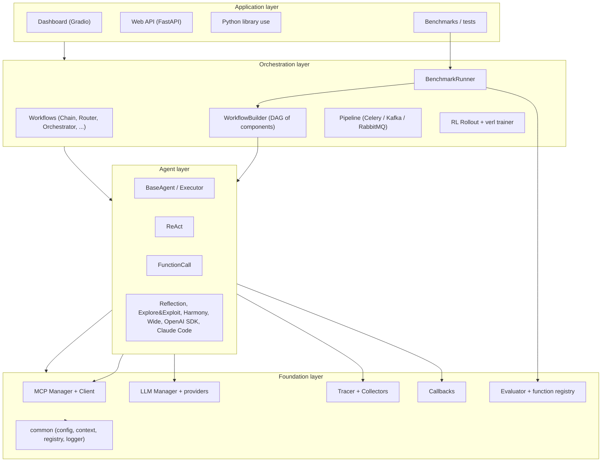

**Dependency direction:** everything depends **inward** toward `common` and the foundation. Agents depend on `mcp` + `llm`; the builder wires them; the benchmark runner drives the builder + evaluator.

---

## 4. Package / module map

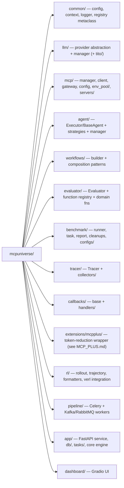

---

## 5. Cross-cutting foundation: `common/`

The glue that the whole framework relies on.

| File | Role |
|------|------|
| `common/misc.py` | **Component registry + metaclasses** — `AutodocABCMeta`, `ComponentABCMeta`, `BaseBuilder`, `ExportConfigMixin` |
| `common/config.py` | `BaseConfig` dataclass base (load from dict/str, `to_dict`, env templating) |
| `common/context.py` | `Context` — env var bag + metadata passed through the call graph |
| `common/logger.py` | `get_logger()` standardized logging |

### Component registry (the most important pattern to understand)

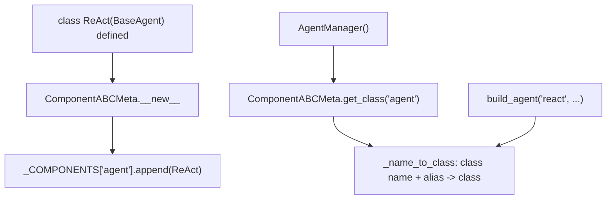

- Every subclass of a registered base is **auto-registered by module name** (`agent`, `llm`, `evaluator`, etc.) via the metaclass `ComponentABCMeta`.
- Managers (`AgentManager`, `ModelManager`) resolve a **type string or `alias`** to a class.
- **Implication for refactoring:** adding a new agent/LLM is just defining a class with an `alias` and importing it in the module `__init__.py`. Duplicate class names within a module raise at import time.

### Config system

- All component configs subclass `BaseConfig` (dataclass) and support `.load(dict | path)`.
- `jinja2` `{{ VAR }}` templating is resolved against `os.environ` + `Context.env` in MCP server configs, evaluator values, and task values.

---

## 6. LLM layer — `llm/`

Provider-agnostic text generation with sync + async + tracing.

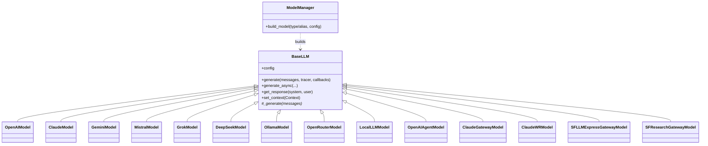

| File | Provider / role |
|------|-----------------|
| `base.py` | `BaseLLM` — `generate` wraps `_generate` with tracing + callback events; `generate_async` adds retry/timeout (`asyncio.wait_for`) |
| `manager.py` | `ModelManager.build_model(name, config)` via registry |
| `openai.py` | OpenAI (`gpt-*`, reasoning_effort handling) |
| `claude.py`, `claude_gateway.py`, `claude_wr.py` | Anthropic + gateway variants |
| `gemini.py`, `mistral.py`, `grok.py`, `deepseek.py` | Other vendors |
| `ollama.py`, `openrouter.py`, `local_llm.py` | OpenAI-compatible / local / vLLM-served |
| `openai_agent.py` | OpenAI Agents SDK backend |
| `sf_*_gateway.py` | Salesforce internal gateways |
| `tito/` | **Token-In-Token-Out** — direct vLLM engine, trajectory manager, RL wrapper (`AsyncVLLMEngine`, `TITOLLMWrapper`) |
| `utils.py` | shared helpers |

**Key behaviors:**
- `_generate` returns either content string, parsed pydantic model (`response_format`), or the raw response object when `tools` are present (so callers can read `tool_calls`).
- Errors are swallowed to `None` with retry/backoff — callers must handle `None`.
- `env_vars` class attr enables `list_undefined_env_vars()` pre-flight checks.

---

## 7. MCP layer — `mcp/`

Manages MCP server processes and the client sessions agents call through.

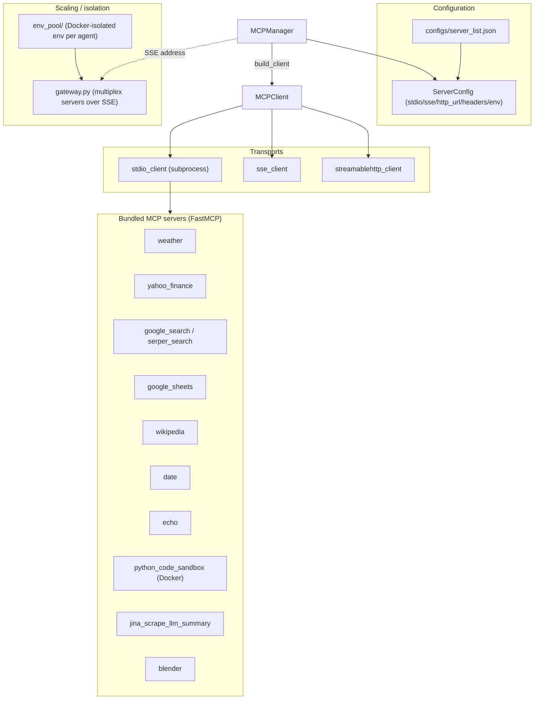

| File | Role |
|------|------|
| `manager.py` | `MCPManager` — load/register server configs, env templating, `build_client(name, transport)` |
| `client.py` | `MCPClient` — connect (stdio/SSE/HTTP), `list_tools`, `execute_tool` with retry + per-call timeout; hardened for Ray/async cleanup |
| `config.py` | `ServerConfig` + `CommandConfig` (jinja templating, unspecified-param detection) |
| `gateway.py` | Long-running gateway that fronts many servers over SSE — built for high-concurrency RL rollouts |
| `permission.py` | Tool-call permission rules (`allow` / `reject` / `human_review`) |
| `env_pool/` | `EnvConfig`, `DockerProvisioner`, `EnvPoolManager` — per-agent Docker env with its own gateway |
| `servers/*/` | First-party MCP servers (each: `server.py` builds `FastMCP`, `__main__.py` is the stdio/SSE entrypoint) |

**Transport selection per server** is data-driven from `server_list.json`: a server entry can define `stdio`, `sse`, and/or `http_url`. Templated `{{PORT}}`, `{{API_KEY}}`, etc. are resolved from env/context.

### Env pool (RL / parallel isolation)

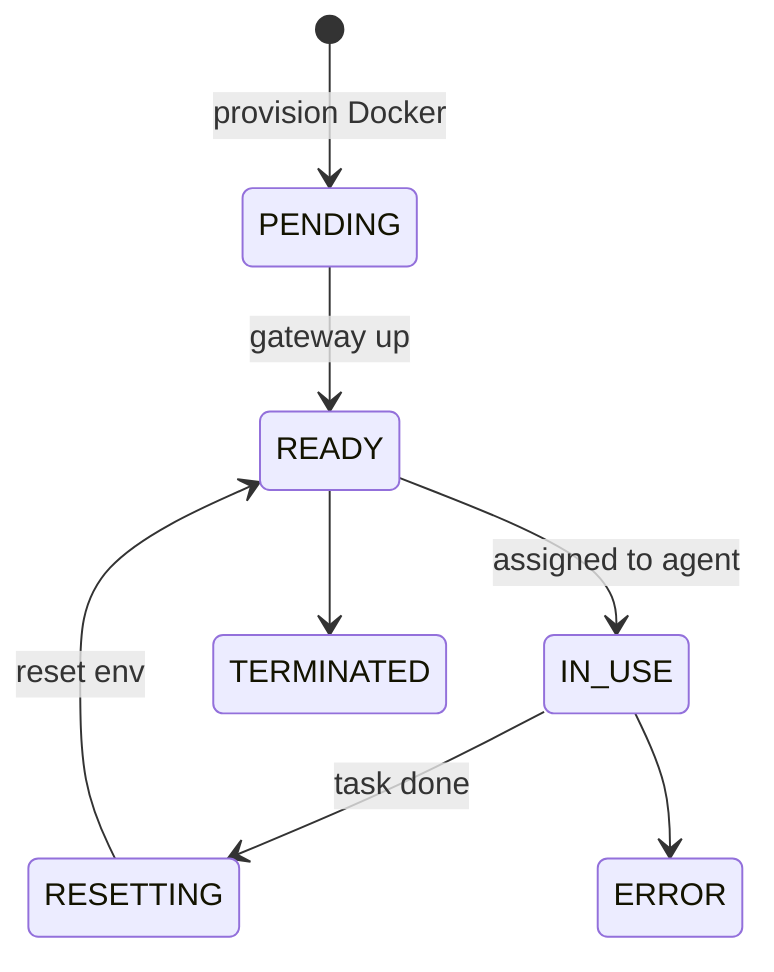

---

## 8. Agent layer — `agent/`

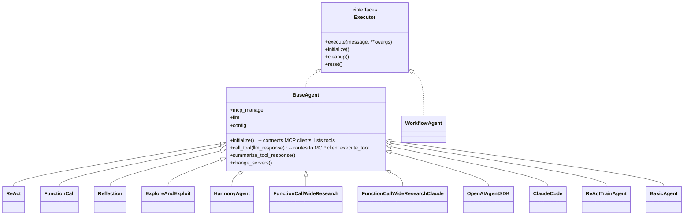

| File | Agent type / role |
|------|-------------------|
| `base.py` | `Executor` interface + `BaseAgent` (config, MCP client lifecycle, `call_tool`, tool-response summarization, prompt building, tracing/callbacks) |
| `types.py` | `AgentResponse` data model |
| `manager.py` | `AgentManager.build_agent(type, mcp_manager, llm, config)` |
| `react.py` | **ReAct** reasoning+acting loop (`alias: react`) |
| `function_call.py` | Native LLM tool-calling agent |
| `reflection.py` | Self-reflection loop |
| `explore_and_exploit.py` | Explore/exploit strategy |
| `harmony_agent.py` | Harmony (GPT-OSS) format agent |
| `function_call_wide.py` / `_claude.py` | **Wide & Deep** parallel tool-calling research agents |
| `openai_agent_sdk.py` | Wraps OpenAI Agents SDK |
| `claude_code.py` | Claude Code SDK agent |
| `react_train_agent.py` | ReAct variant instrumented for RL training |
| `basic.py` | Minimal single-shot agent |
| `workflow.py` | Adapter so a workflow is usable as an `Executor` |
| `utils.py` | prompt building (`build_system_prompt`), Harmony rendering helpers |
| `configs/*.j2` | Jinja prompt templates (react_prompt, system_prompt, tools_prompt, ...) |

### Agent execution loop (ReAct example)

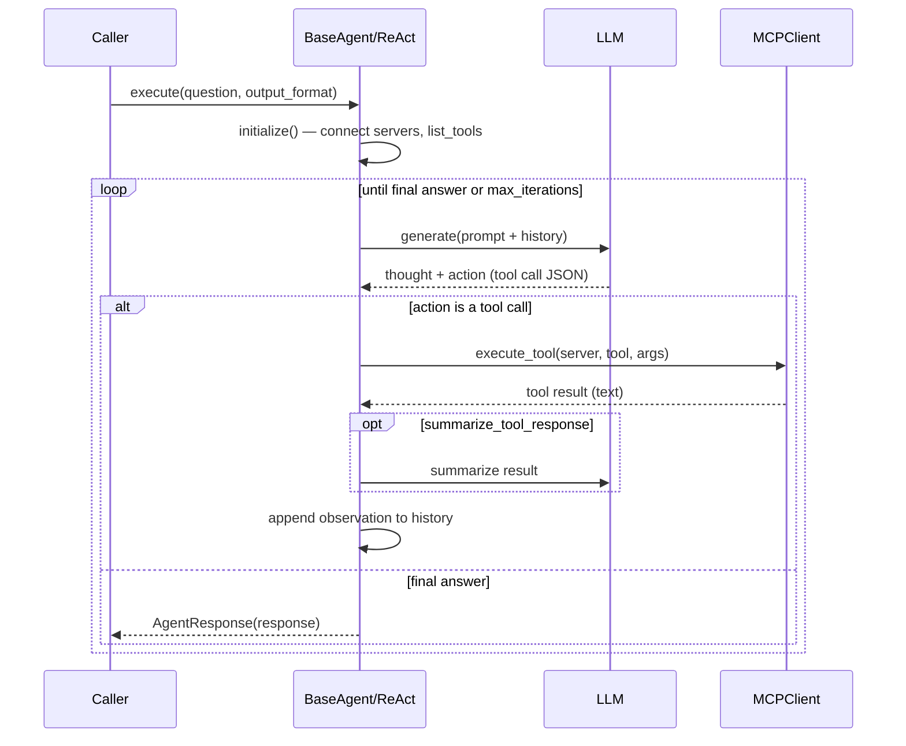

---

## 9. Workflow composition — `workflows/`

Builds a **DAG of components** (LLMs, agents, sub-workflows) from YAML/dicts and exposes higher-order orchestration patterns.

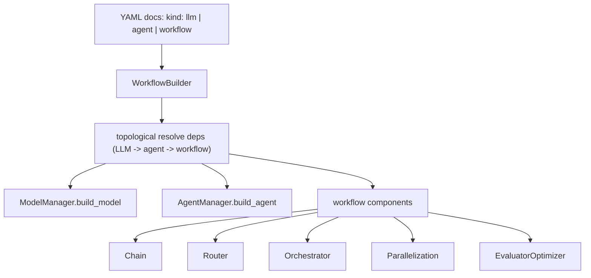

| File | Pattern |
|------|---------|
| `builder.py` | `WorkflowBuilder` — parse configs, build dependency graph, instantiate components, inject LLM into agents |
| `base.py` | Base workflow `Executor` |
| `chain.py` | Sequential pipeline |
| `router.py` | Route input to one of N branches |
| `orchestrator.py` | Planner/orchestrator over sub-agents |
| `parallelization.py` | Fan-out / fan-in |
| `evaluator_optimizer.py` | Generate→evaluate→refine loop |

`Spec` model = `{type, name, config, is_main}`; `WorkflowConfig = {kind, spec}`. The builder is the central composition root (the MCP+ extension subclasses it to add a 4th `kind: wrapper`).

---

## 10. Evaluation — `evaluator/`

A small **expression engine**: `func(...) op value`.

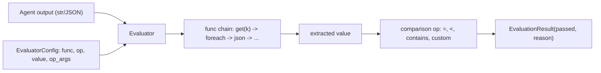

| File | Role |
|------|------|
| `evaluator.py` | `EvaluatorConfig`, `Evaluator` (parse func chain, apply op), `EvaluationResult` |
| `functions.py` | `@eval_func` / `@compare_func` registries; built-ins (`json`, `get`, `foreach`, comparisons) |
| `__init__.py` | imports domain function packs to register them |
| domain packs | `google_search/`, `deepresearch/`, `notion/`, `weather/`, `mcpmark/` (github/notion/postgres/playwright/filesystem), `blender/` |

**Extension point:** register a new check with `@eval_func("name")`; reference it from task JSON `"func"`/`"op"`. (This is exactly how the excluded McDonald's evaluators plug in.)

---

## 11. Benchmarking — `benchmark/`

The default driver for evaluating agents.

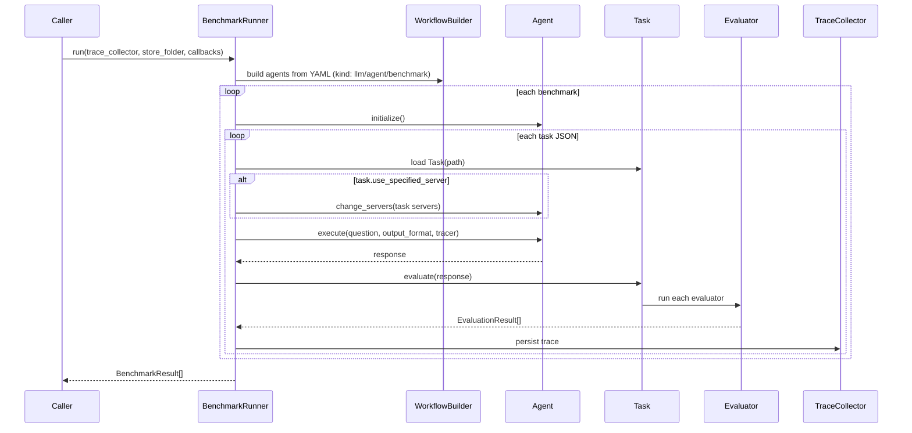

| File | Role |
|------|------|
| `runner.py` | `BenchmarkRunner` (loads YAML into `_agent_configs` + `_benchmark_configs`), `BenchmarkConfig`, `BenchmarkResult`, `BenchmarkResultStore` (resume via md5 of task) |
| `task.py` | `Task` / `TaskConfig` — question, `output_format`, `mcp_servers`, `use_specified_server`, evaluators, **prepare** + **cleanup** hooks |
| `report.py` | `BenchmarkReport` — markdown report from results + traces |
| `cleanups.py` | `CLEANUP_FUNCTIONS` (undo side effects, e.g. delete repo) |
| `configs/` | YAML benchmark configs + task JSON: `mcpuniverse/` (web_search, location_navigation, browser_automation, financial_analysis, repository_management, 3d_design, multi_server), `mcpmark/`, `deepresearch/`, `dummy/` |

**Task lifecycle:** optional `prepare_func` (seed env, e.g. vector DB) → agent run → `evaluate` → optional `cleanup_func`.

---

## 12. Observability — `tracer/` + `callbacks/`

Two complementary mechanisms: **tracer** = structured execution record; **callbacks** = live event stream.

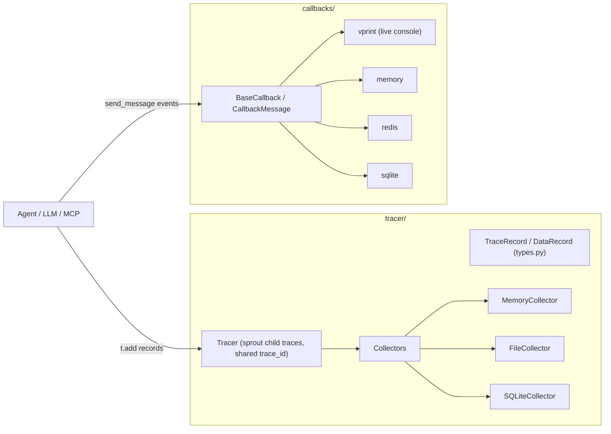

- **Tracer**: `tracer.sprout()` creates child traces sharing a `trace_id`; LLM/tool/agent steps call `t.add({...})`. Collector pluggable (RAM / file / SQLite).
- **Callbacks**: typed `CallbackMessage` (EVENT/STATUS/RESPONSE/LOG/PROGRESS/ERROR). `get_vprint_callbacks()` prints intermediate steps; Redis handler powers the web/dashboard live view.

---

## 13. MCP+ extension — `extensions/mcpplus/`

Token-reduction client wrapper. **Full deep dive in [`MCP_PLUS.md`](./MCP_PLUS.md).** In brief:

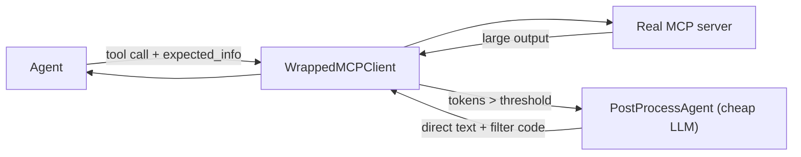

Subclasses the core: `MCPWrapperManager(MCPManager)`, `WorkflowBuilderWithWrapper(WorkflowBuilder)`, `BenchmarkRunnerWithWrapper(BenchmarkRunner)` — a good template for how to extend core cleanly.

---

## 14. RL training — `rl/`

Online RL (GRPO) where trajectories are real multi-turn MCP agent episodes; rewards come from benchmark evaluators.

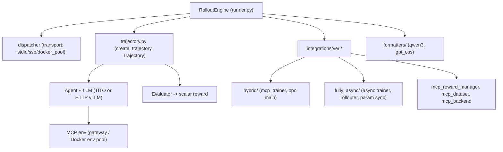

| Area | Files |
|------|-------|
| Rollout | `runner.py` (`RolloutEngine`, `RolloutOutput`), `dispatcher.py`, `trajectory.py`, `trace_logger.py`, `config.py` |
| Formatters | `formatters/` — Harmony/Qwen3/GPT-OSS chat formatting |
| verl integration | `integrations/verl/` — `mcp_loop_manager`, `mcp_reward_manager`, `mcp_dataset`, `mcp_backend`; `hybrid/` (sync PPO) and `fully_async/` (async trainer + param sync) |

Transport modes: `stdio` (process per agent), `sse` (shared gateway), `docker_pool` (isolated container per agent).

---

## 15. Distributed pipeline — `pipeline/`

Run benchmarks/agents as distributed jobs.

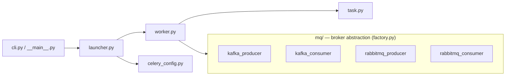

`mq/factory.py` selects Kafka vs RabbitMQ behind a common `base.py` interface; Celery config for task scheduling.

---

## 16. Web service — `app/`

FastAPI backend that exposes projects/benchmarks/jobs and runs them via Celery.

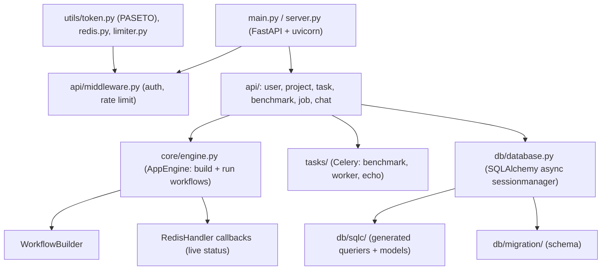

| Area | Files |
|------|-------|
| Entry | `main.py`, `server.py` |
| API | `api/{user,project,task,benchmark,job,chat,middleware}.py` |
| Core | `core/engine.py` (`AppEngine.check_config`, build + execute workflows, Redis-backed live callbacks) |
| Async tasks | `tasks/{benchmark,worker,echo,celery_config}.py` |
| DB | `db/database.py` (async SQLAlchemy), `db/sqlc/*` (sqlc-style queriers + `models_sqlalchemy.py`), `db/migration*` |
| Utils | `utils/token.py` (PASETO via `pyseto`), `utils/redis.py`, `utils/limiter.py` |

Auth uses **PASETO tokens** + `bcrypt` password hashing; persistence is **async SQLAlchemy** over PostgreSQL; long jobs run on **Celery + Redis**.

---

## 17. Dashboard — `dashboard/`

Gradio UI for interactive exploration.

| File | Role |
|------|------|
| `app.py` | Gradio app entry |
| `manager.py` | Backend coordination |
| `pages/{agent,benchmark,chatbot,utils}.py` | UI tabs (run agents, view benchmarks, chat) |

---

## 18. Key extension points (for refactor / new work)

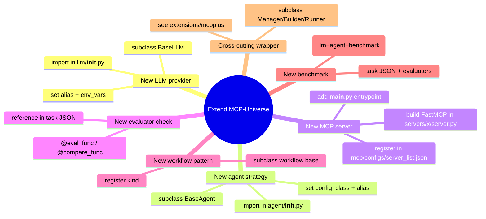

All four core registries (`llm`, `agent`, `evaluator`, plus eval/compare function dicts) follow the **decorator/metaclass auto-registration** pattern — new components are additive and discovered by `type`/`alias`.

---

## 19. Representative data/config contracts

**Benchmark YAML** (multi-doc): `kind: llm` → `kind: agent` → `kind: benchmark` (tasks list).
**Task JSON**: `question`, `output_format`, `mcp_servers`, `use_specified_server`, `evaluators[]`, optional `prepare`/`cleanup`.
**Server entry** (`server_list.json`): per-server `stdio` / `sse` / `http_url` + `env` with jinja `{{VARS}}`.
**Evaluator**: `{ "func": "...chain...", "op": "=", "value": ..., "op_args": ... }`.

---

## 20. Refactoring observations (non-blocking)

| Area | Observation |
|------|-------------|
| **LLM error handling** | `_generate` returns `None` on failure (swallowed). Callers must null-check; a typed error/result could be clearer. |
| **`server_list.json` uses `python3`** | Hard-coded interpreter name; brittle on Windows (needs venv `python3` on PATH). Candidate for `sys.executable`. |
| **Registry import side-effects** | Components only register when their module is imported (`__init__.py` import lists). Easy to "lose" a component by forgetting the import. |
| **Many provider files** | 15+ LLM provider modules with overlapping logic; a shared OpenAI-compatible base could reduce duplication (Ollama/OpenRouter/DeepSeek already lean on OpenAI client). |
| **Mixed config styles** | dataclass `BaseConfig` (components) vs pydantic `BaseModel` (workflow/task/eval). Intentional but worth noting for consistency work. |
| **`SafeCodeExecutor` timeout** | Uses `signal.SIGALRM` (no-op on Windows) — see MCP+ doc. |
| **Async cleanup complexity** | `mcp/client.py` carries significant Ray/SSE cleanup hardening; central to RL stability — touch carefully. |

---

## 21. One-paragraph mental model

MCP-Universe is organized as **inward-pointing layers** around a `common` registry core. You describe an experiment in **YAML** (LLM + agent + benchmark) and **task JSON** (question + MCP servers + evaluators). The **WorkflowBuilder** resolves those into concrete components using **auto-registered managers**; agents talk to tools through the **MCPManager/MCPClient** over stdio/SSE/HTTP (optionally a **gateway** or **Docker env pool** for scale), and to models through the **multi-provider LLM layer**. The **BenchmarkRunner** drives tasks and scores outputs with the **evaluator expression engine**, while **tracer** + **callbacks** record and stream everything. On top sit four delivery surfaces — **FastAPI web service**, **Celery/MQ pipeline**, **verl RL trainer**, and **Gradio dashboard** — plus the **MCP+** wrapper that compresses tool outputs. New capabilities are almost always added by subclassing a base and registering an `alias`, not by editing the core.
